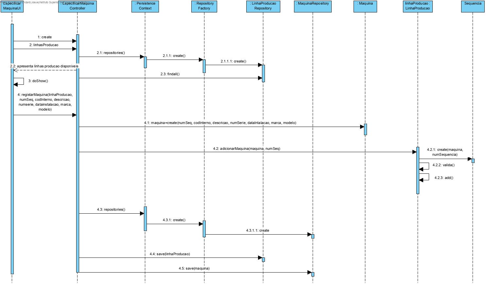
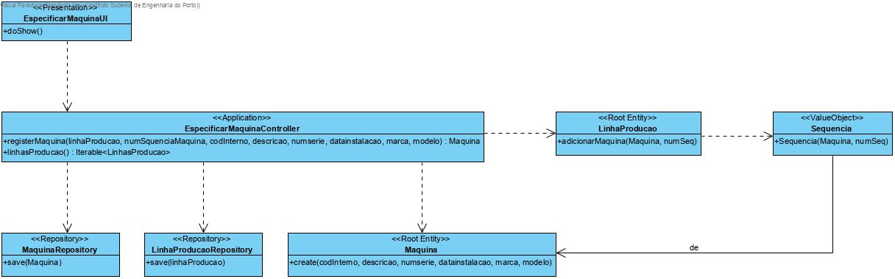

**Josué Mota [1171668](../)** - [3001] Especificar Máquina
=======================================

# 1. Requisitos

- Como Gestor de Chão de Fábrica, eu quero especificar a existência de uma nova máquina.

# 2. Análise

- Uma máquina possui um código interno, um número de série, uma descrição, uma data de instalação, uma marca e modelo.
- Uma máquina existe apenas no contexto de uma linha de produção

# 3. Design

## 3.1. Realização da Funcionalidade

## 3.2. Diagrama de Classes

## 3.3. Padrões Aplicados

Repository Factory para criar e persistir uma maquina, assim como a informação da sua posição numa determinada linha de produção.

## 3.4. Testes 

	// save
        CodInterno codInterno = new CodInterno("1001");
        DataInstalacao dataInstalacao = new DataInstalacao(DateTime.parseDate("10/10/2010", "DD/MM/YYYY"));
        Descricao descricao = new Descricao("brief description.");
        Marca marca = new Marca("ABC");
        Modelo modelo = new Modelo("XYZ");
        NumSerie numSerie = new NumSerie("12l");
        
        repo.save(new Maquina(codInterno, descricao, numSerie, dataInstalacao, marca, modelo));
        
        CodInterno codInterno2 = new CodInterno("1002");
        DataInstalacao dataInstalacao2 = new DataInstalacao(DateTime.parseDate("20/10/2018", "DD/MM/YYYY"));
        Descricao descricao2 = new Descricao("brief description.");
        Marca marca2 = new Marca("ABC");
        Modelo modelo2 = new Modelo("XYZed");
        NumSerie numSerie2 = new NumSerie("12l9");
        
        repo.save(new Maquina(codInterno2, descricao2, numSerie2, dataInstalacao2, marca2, modelo2));
        
        LOGGER.info("»»» Maquinas criadas");

        try {
            repo.save(new Maquina(codInterno2, descricao2, numSerie2, dataInstalacao2, marca2, modelo2));
        } catch (Exception e) {
            LOGGER.info("»»» tentar gravar maquina repetida");
        }
        
        // findAll
        final Iterable<Maquina> l = repo.findAll();
        Invariants.nonNull(l);
        Invariants.nonNull(l.iterator());
        Invariants.ensure(l.iterator().hasNext());
        LOGGER.info("»»» encontrar todos as maquinas");

        // count
        final long n = repo.count();
        LOGGER.info("»»» # maquinas = {}", n);

        // ofIdentity
        
        final Maquina m1 = repo.ofIdentity(new CodInterno("1001")).orElseThrow(IllegalStateException::new);
        final Maquina m2 = repo.ofIdentity(new CodInterno("1002")).orElseThrow(IllegalStateException::new);
        //LOGGER.info("»»» encontrar maquinas através da sua identidade");
        
        // containsOfIdentity
        final boolean hasId = repo.containsOfIdentity(m1.identity());
        Invariants.ensure(hasId);
        LOGGER.info("»»» encontrar maquina que contenha identidade");

        // contains
        final boolean has = repo.contains(m1);
        Invariants.ensure(has);
        LOGGER.info("»»» contém maquina");

        // delete
        repo.delete(m1);
        LOGGER.info("»»» apagar maquina");

        // deleteOfIdentity
        repo.deleteOfIdentity(m2.identity());
        LOGGER.info("»»» apagar maquina que contenha identidade");

        // size
        final long n2 = repo.size();
        Invariants.ensure(n2 == n - 2);
        LOGGER.info("»»» # maquina = {}", n2);

# 4. Implementação

## 4.1 Controller

    public Maquina registerMaquina(final LinhaProducao linhaProducao,Long numSquenciaMaquina,
            final String codInterno, final String descricao, final String numserie, 
            final String datainstalacao, final String marca, final String modelo){
        authz.ensureAuthenticatedUserHasAnyOf(BaseRoles.POWER_USER,
                BaseRoles.GESTOR_CHAO_FABRICA);

        
        
        
        final Maquina maquina = new Maquina(new CodInterno(codInterno), new Descricao(descricao), 
                new NumSerie(numserie), new DataInstalacao(DateTime.parseDate(datainstalacao, "DD/MM/YYYY")), 
                new Marca(marca), new Modelo(modelo));
        
        
        if(linhaProducao.adicionarMaquina(new Sequencia(numSquenciaMaquina, maquina))==false) {
            System.out.println("erro ao associar maquina à linha. ");
            return null;
        }
        
        this.maquinaRepository.save(maquina);
        
        this.linhaProducaoRepository.save(linhaProducao);

        return maquina;
    }
    
    public Iterable<LinhaProducao> linhasProducao() {
        return this.svc.todasLinhas();
        
    }

# 5. Integração/Demonstração

*Nesta secção o estudante deve descrever os esforços realizados no sentido de integrar a funcionalidade desenvolvida com as restantes funcionalidades do sistema.*

# 6. Observações

*Nesta secção sugere-se que o estudante apresente uma perspetiva critica sobre o trabalho desenvolvido apontando, por exemplo, outras alternativas e ou trabalhos futuros relacionados.*
