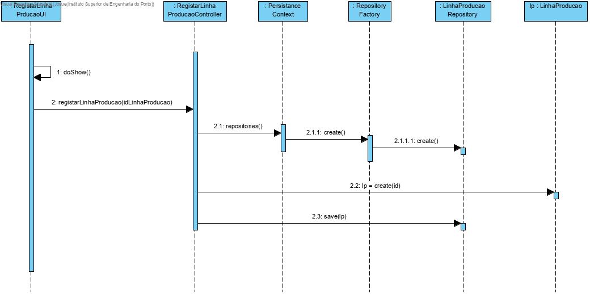
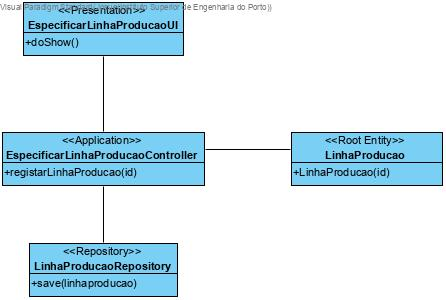

**Josué Mota [1171668](../)** - [3002] Especificar Linha de Produção
=======================================

# 1. Requisitos

- Como Gestor de Chão de Fábrica, eu quero especificar a existência de uma linha de produção.

# 2. Análise

- Uma linha de produção é caracterizado por um código único.
- por simplificação assume-se que uma linha de produção é apenas uma sequência continua de máquinas.

# 3. Design

## 3.1. Realização da Funcionalidade

## 3.2. Diagrama de Classes

## 3.3. Padrões Aplicados

Repository Factory para criar e persistir uma linha de Producao.

## 3.4. Testes 

	Long id1 = 10l;
	repo.save(new LinhaProducao(id1));
	Long id2 = 20l;
	repo.save(new LinhaProducao(id2));
	Long id3 = 30l;
	repo.save(new LinhaProducao(id3));
	LOGGER.info("»»» Linhas de Produção criadas");
	
	try {
		repo.save(new LinhaProducao(id1));
	} catch (Exception e) {
		LOGGER.info("»»» tentar gravar linha de produção repetido");
	}
	
	// findAll
	final Iterable<LinhaProducao> l = repo.findAll();
	Invariants.nonNull(l);
	Invariants.nonNull(l.iterator());
	Invariants.ensure(l.iterator().hasNext());
	LOGGER.info("»»» encontrar todos os produtos");

	// count
	final long n = repo.count();
	LOGGER.info("»»» # Linhas Producao = {}", n);
	
	
	// ofIdentity
	final LinhaProducao l1 = repo.ofIdentity(id1).orElseThrow(IllegalStateException::new);
	final LinhaProducao l2 = repo.ofIdentity(id2).orElseThrow(IllegalStateException::new);
	LOGGER.info("»»» encontrar Linhas de Produção através da sua identidade");

	// containsOfIdentity
	final boolean hasId = repo.containsOfIdentity(l1.identity());
	Invariants.ensure(hasId);
	LOGGER.info("»»» encontrar Linhas de Produção que contenha identidade");
	
	// contains
	final boolean has = repo.contains(l1);
	Invariants.ensure(has);
	LOGGER.info("»»» contém Linha de Produção");

	// delete
	repo.delete(l1);
	LOGGER.info("»»» apagar Linha de Produção");

	// deleteOfIdentity
	repo.deleteOfIdentity(l2.identity());
	LOGGER.info("»»» apagar Linha de Produção que contenha identidade");

	// size
	final long n2 = repo.size();
	Invariants.ensure(n2 == n - 2);
	LOGGER.info("»»» # Linha de Produção = {}", n2);

# 4. Implementação

## 4.1 Controller

	public LinhaProducao registarLinhaProducao(final Long id) {
		authz.ensureAuthenticatedUserHasAnyOf(BaseRoles.POWER_USER, BaseRoles.GESTOR_CHAO_FABRICA);

		try {
			final LinhaProducao linhaProducao = new LinhaProducao(id);
			return this.repository.save(linhaProducao);
		} catch (Exception e) {
			System.out.println(e.getMessage());
			return null;
		}
	}

# 5. Integração/Demonstração

*Nesta secção o estudante deve descrever os esforços realizados no sentido de integrar a funcionalidade desenvolvida com as restantes funcionalidades do sistema.*

# 6. Observações

*Nesta secção sugere-se que o estudante apresente uma perspetiva critica sobre o trabalho desenvolvido apontando, por exemplo, outras alternativas e ou trabalhos futuros relacionados.*
