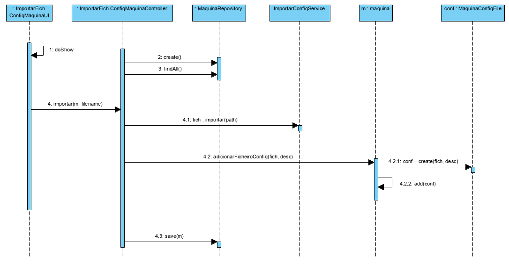
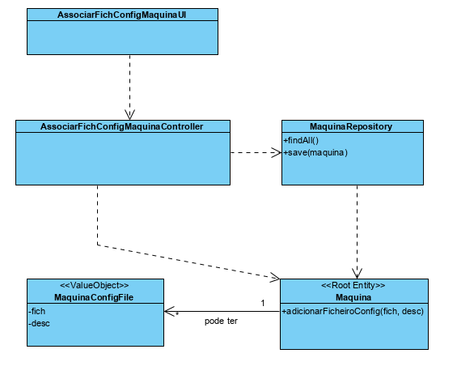

**Josué Mota [1171668](../)** - [3004] Associar um ficheiro de configuração a uma máquina.
=======================================

# 1. Requisitos

- Como Gestor de Chão de Fábrica, eu pretendo associar um ficheiro de configuração a uma máquina.
- Deve existir a possibilidade de associar à máquina um ou mais ficheiros de configuração complementados com uma breve descrição.
- A edição/manutenção do conteúdo destes ficheiros é realizada fora do âmbito do sistema a desenvolver.
- O conteúdo dos ficheiros é sempre do tipo **texto**.
- O sistema deve conseguir guardar o seu conteúdo e posteriormente (noutra US) ser capaz de recriar esse conteúdo para envia-lo a uma máquina.

# 2. Análise

## 2.1 Regras de negócio
- Ficheiros de configuração são complementados com uma breve descrição.
- Uma maquina pode ter vários ficheiros de configuração.
- O ficheiro não pode estar vazio.

# 3. Design

## 3.1. Realização da Funcionalidade

## 3.2. Diagrama de Classes

## 3.3. Padrões Aplicados

- Repository Factory para recriar/persistir o objeto Máquina.
- Padrão Strategy para a importação de ficheiros.

## 3.4. Testes 

### 3.4.1 Testes unitários

- verificar se o conteudo do ficheiro está vazio.

- verificar os limites da descrição. (min/max chars | vazio)

# 4. Implementação

## 4.1 Dominio

[dominio/MaquinaConfigFile](https://bitbucket.org/joaomfas/lei_isep_2019_20_sem4_2na_1181436_1171668_1171865_1190293/src/master/app/base.core/src/main/java/eapli/base/gestaomaquinas/domain/MaquinaConfigFile.java)

## 4.1 Controller

[ImportarFichConfigMaquinaController](https://bitbucket.org/joaomfas/lei_isep_2019_20_sem4_2na_1181436_1171668_1171865_1190293/src/master/app/base.core/src/main/java/eapli/base/gestaomaquinas/application/ImportarFichConfigMaquinaController.java)

# 5. Integração/Demonstração
Não Aplicavel.

# 6. Observações
Embora o Padrão Strategy faça mais sentido quando existem vários tipos de ficheiro a importar. Foi escolhido este padrão para facilitar futuras alterações.