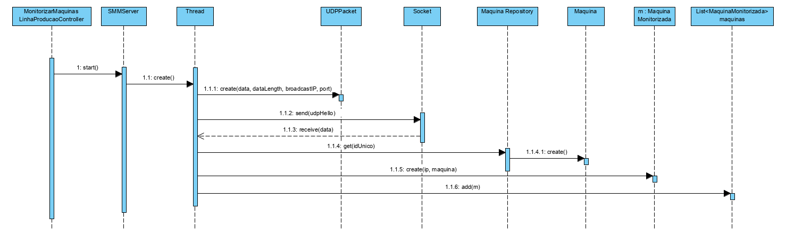
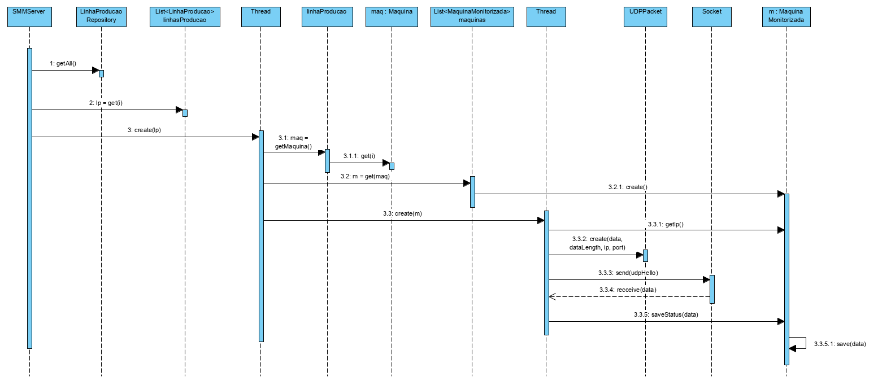

**Josué Mota [1171668](../)** - [6001] Monitorizar o estado das maquinas por linha de produção.
=======================================

# 1. Requisitos

- Como Sistema de Monitorização das Máquinas (SMM), pretendo monitorizar o estado das máquinas por linha de produção.

# 2. Análise

## Prerequisitos
O sistema de monitorização deve possuir uma **lista de endereços de rede a serem monitorizados** que podem ser:
- (unicast) 1 endereço ou
- (broadcast) 1 rede de endereços

## 2.1 Regras de negócio
- Não há conhecimento mútuo inicial
- As máquinas industriais tornam-se conhecidas pelo sistema de monitorização ao responder a pedidos **HELLO** remetidos por este;
- As máquinas industriais **nunca enviam pedidos** ao sistema de monitorização.

## 2.2 General Flow

- O sistema de monitorização envia pedidos **HELLO** baseados em **UDP** para máquinas industriais. 
- Neste caso específico, nestes pedidos não consta o **número de identificação único** da máquina e, portanto,
deve ser zero. 
- A resposta ao pedido HELLO (dependendo da última resposta que a máquina industrial recebeu do **sistema central**) é: 
    - **ACK**  (accepted and executed)
    - **NACK** (refused and ignored)
- ACK e NACK podem conter um texto de status 
- A partir das respostas que chegam ao sistema de
monitorização, uma lista de máquinas industriais é construída e mantida. 
- Se não houver atualização de uma máquina industrial por mais de **um minuto (valor configurável)**, esta deverá ser marcada como indisponível, mas não removida da lista.

## 3.3 Tratamento  de Erros

- O sistema deve ser capaz de detetar a existencia de números únicos duplicados, de forma a facilitar a sua correção.

# 3. Design

## 3.1. Realização da Funcionalidade

# 6. Observações.
Apenas é necessário preservar as respostas de cada máquina.