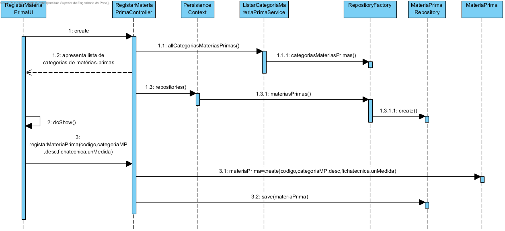

**Maria João Dias [1171865](../)** - [2001] Adicionar uma nova matéria-prima ao catálogo de matérias-primas
=======================================

# 1. Requisitos
Como Gestor de Produção, eu pretendo adicionar uma matéria-prima ao catálogo.

A interpretação feita deste requisito foi no sentido de criar matérias-primas para que possam estar disponiveis para a criação de produtos.

# 2. Análise
## 2.1 Regras de Negócio
Uma matéria-prima é caracterizada por um código interno, uma descrição, uma categoria, uma ficha técnica (documento pdf) e ainda pelas unidades de medida que serão utilizadas para esta matéria-prima.
- Código ÚNICO interno com 10 caracteres no máximo;
- Descrição da matéria-prima com 50 caracteres no máximo;
- Categoria da matéria-prima de seleção obrigatória;
- Ficha técnica é um documento pdf indicado pelo utilizador.
- Unidade de medida corresponde apenas a um conjunto limitado de unidades de medida definidas
(Todos os campos deverão ser fornecidos.)

A semântica para estes requisitos é dada pelo utilizador do sistema.

Após analisar as regras de negócio, verifico a necessidade de estender o modelo de domínio para fazer ligação aos value objects: unidade de medida e descrição.

# 3. Design
## 3.1. Realização da Funcionalidade

## 3.2. Diagrama de Classes

## 3.3. Padrões Aplicados
Aplicar o padrão Repository Factory que permite criar repositórios de forma dinâmica e isolar o controller do US da tecnologia utilizada para a persistência de dados.

## 3.4. Testes
**Testes unitários:**
Deverão ser implementados testes que verifiquem as regras de negócios:
- Nenhum dos parâmetros de matéria-prima pode ser nulo;
- Os value objects que compõem matéria-prima não podem ter dados vazios.

**Smoke tests:**
Deverão ser implementados testes CRUD (Create, Read, Update, Delete) para garantir o correto funcionamento do mecanismo de persistência dos dados:
- Gravar dados
- Aceder a Matérias-primas pelo seu Código Interno
- Apagar Matérias-primas pelo seu Código Interno

**Testes manuais:**
Os testes manuais servirão para eliminar possíveis bugs na UI e garantir o correto comportamento da aplicação ao serem inseridos dados inválidos.

# 4. Implementação
## 4.1. User Interface
    protected boolean doShow() {
        final int EXIT_OPTION = 0;
        final Iterable<CategoriaMateriaPrima> categoriasMP = this.theController.categoriasMateriasPrimas();
        if(((ArrayList<CategoriaMateriaPrima>)categoriasMP).isEmpty()) {
          System.out.println("Não existem categorias de matéria prima registadas.");
          return false;
        }

        final SelectWidget<CategoriaMateriaPrima> selector = new SelectWidget<>("Categorias matéria prima:", categoriasMP, new CategoriaMateriaPrimaPrinter());
        selector.show();

        if(selector.selectedOption() == EXIT_OPTION){
          return false;
        }

        final CategoriaMateriaPrima aCategoriaMP = selector.selectedElement();
        final String codigoInterno = Console.readLine("Código Interno:");
        final String descricao = Console.readLine("Descrição:");
        final String fichaTecnicaPath = Console.readLine("Caminho da ficha Técnica:");
        final String unidadeMedida = Console.readLine("Unidade de Medida:");

        try {
          this.theController.registarMateriaPrima(codigoInterno, aCategoriaMP, descricao,
                  fichaTecnicaPath, unidadeMedida);
        } catch (@SuppressWarnings("unused") final Exception e) {
          System.out.println(e.getMessage());
        }
        return false;
    }

## 4.2. Controller
Para fazer o registo de uma matéria-prima é necessário recorrer a um serviço que liste primeiro as categorias de matérias-primas e assim se possa escolher qual a categoria pretendida.

    public Iterable<CategoriaMateriaPrima> categoriasMateriasPrimas() {
        return this.svc.allCategoriasMateriasPrimas();
    }

    public MateriaPrima registarMateriaPrima(final String codigo, final CategoriaMateriaPrima categoriaMP, final String descricao, final String fichaTecnicaPath, final String unidadeMedida) {
      authz.ensureAuthenticatedUserHasAnyOf(BaseRoles.GESTOR_PRODUCAO, BaseRoles.POWER_USER);
      try {
        final MateriaPrima newMateriaPrima = new MateriaPrima(new CodigoInterno(codigo), categoriaMP, new Descricao(descricao), new FichaTecnica(fichaTecnicaPath), new UnidadeMedida(unidadeMedida));
        return this.repository.save(newMateriaPrima);
      } catch (Exception e) {
        System.out.println(e.getMessage());
        return null;
      }
    }

## 4.3. Service

    public Iterable<CategoriaMateriaPrima> allCategoriasMateriasPrimas() {
        authz.ensureAuthenticatedUserHasAnyOf(BaseRoles.POWER_USER, BaseRoles.GESTOR_PRODUCAO);
        return this.categoriaMateriaPrimaRepository.findAll();
    }

## 4.4. Ficha Técnica
Para a implementação de ficha técnica de matéria prima recorreu-se às anotações @Lob e @Basic, interfaces do package javax.persistence.

A anotação @Lob permite persistir um objeto de grande dimensão na base de dados, num formato binário

    @Lob
    @Column(name = "FICHA_TECNICA", columnDefinition = "BLOB")
    private byte[] fichaTecnicaInBytes;

A anotação @Basic com a opção fetch=FetchType.LAZY permite que o objeto FichaTecnica não seja carregado na base de dados até que seja explicitamente pedido.
Ou seja, ao consultar matérias-primas, o campo de ficha técnica aparece como null, de forma a não sobrecarregar a aplicação e assim melhorar a performance da mesma.

    @Basic(fetch=FetchType.LAZY)
    private FichaTecnica fichaTecnica;    

# 5. Integração/Demonstração

A implementação desta US irá integrar Categorias de matérias-primas.

# 6. Observações
Sem observações.
