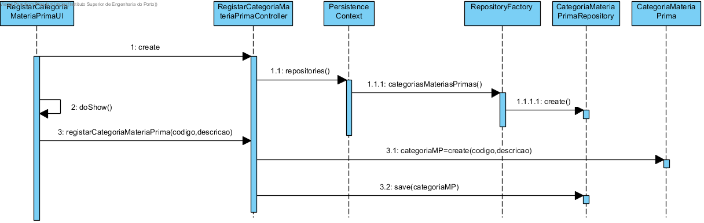

**Maria João Dias [1171865](../)** - [2002] Adicionar categoria de algumas matérias-primas
=======================================

# 1. Requisitos
Como Gestor de Produção, pretendo definir uma nova categoria de matérias-primas.

A interpretação feita deste requisito foi no sentido de criar categorias de matérias-primas para que quando seja adicionada uma matéria-prima, seja apresentada uma lista das categorias existentes para categorizar essa matéria-prima.

# 2. Análise
## 2.1 Regras de Negócio
Uma categoria é caracterizada por um código e uma descrição:
- Código ÚNICO com 10 caracteres no máximo;
- Descrição da categoria com 50 caracteres no máximo;
(Todos os campos deverão ser fornecidos.)

A semântica para estes requisitos é dada pelo utilizador do sistema.

Após analisar as regras de negócio, verifico a necessidade de estender o modelo de domínio para incluir os value objects: código de categoria e descrição.

# 3. Design
## 3.1. Realização da Funcionalidade

## 3.2. Diagrama de Classes

## 3.3. Padrões Aplicados
Aplicar o padrão Repository Factory que permite criar repositórios de forma dinâmica e isolar o controller do US da tecnologia utilizada para a persistência de dados.

## 3.4. Testes
**Testes unitários:**
Deverão ser implementados testes que verifiquem as regras de negócios:
- Nenhum dos parâmetros de Categoria de matéria-prima pode ser nulo;
- Os value objects que compõem Categoria não podem ter dados vazios.

**Smoke tests:**
Deverão ser implementados testes CRUD (Create, Read, Update, Delete) para garantir o correto funcionamento do mecanismo de persistência dos dados:
- Gravar dados
- Aceder a Categorias pelo seu Código de Categoria
- Apagar Categoria pelo seu Código de Categoria

**Testes manuais:**
Os testes manuais servirão para eliminar possíveis bugs na UI e garantir o correto comportamento da aplicação ao serem inseridos dados inválidos.

# 4. Implementação
## 4.1. User Interface
    protected boolean doShow() {
       final String codigoCategoria = Console.readLine("Código Categoria:");
       final String descricao = Console.readLine("Descrição:");
       try {
         this.theController.registarCategoriaMateriaPrima(codigoCategoria, descricao);
       } catch (@SuppressWarnings("unused") final IntegrityViolationException e) {
         System.out.println("Erro ao registar categoria de matéria prima!");
       }
       return false;
     }

## 4.2. Controller
    public CategoriaMateriaPrima registarCategoriaMateriaPrima(final String codigoCategoria, final String descricao) {
        authz.ensureAuthenticatedUserHasAnyOf(BaseRoles.GESTOR_PRODUCAO, BaseRoles.POWER_USER);
        try {
          final CategoriaMateriaPrima newCategoriaMateriaPrima = new CategoriaMateriaPrima(new CodigoCategoria(codigoCategoria), new Descricao(descricao));
          return this.repository.save(newCategoriaMateriaPrima);
        } catch (Exception e) {
          System.out.println(e.getMessage());
          return null;
        }
    }

# 5. Integração/Demonstração
O resultado da implementação desta US irá ser usado para integrar Matérias Primas.

# 6. Observações
Sem observações.
