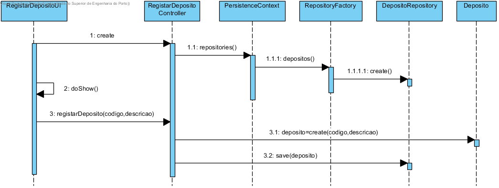

**Maria João Dias [1171865](../)** - [3003] Especificar a existência de um novo depósito
=======================================

# 1. Requisitos
Como Gestor de Chão de Fábrica, eu pretendo especificar a existência de um novo depósito.

A interpretação feita deste requisito foi no sentido especificar depósitos de entrada e saída de matérias-primas e produtos.

# 2. Análise
## 2.1 Regras de Negócio
Um depósito é caracterizado por um código e uma descrição:
- Código ÚNICO alfanumérico com 10 caracteres no máximo;
- Descrição do depósito com 50 caracteres no máximo;
(Todos os campos deverão ser fornecidos.)

Após analisar as regras de negócio, verifico a necessidade de estender o modelo de domínio para incluir os value objects: código de depósito (trocar por id) e descrição.

# 3. Design
## 3.1. Realização da Funcionalidade

## 3.2. Diagrama de Classes

## 3.3. Padrões Aplicados
Aplicar o padrão Repository Factory que permite criar repositórios de forma dinâmica e isolar o controller do US da tecnologia utilizada para a persistência de dados.

## 3.4. Testes
**Testes unitários:**
Deverão ser implementados testes que verifiquem as regras de negócios:
- Nenhum dos parâmetros de Depósito pode ser nulo;
- Os value objects que compõem Depósito não podem ter dados vazios.

**Smoke tests:**
Deverão ser implementados testes CRUD (Create, Read, Update, Delete) para garantir o correto funcionamento do mecanismo de persistência dos dados:
- Gravar dados
- Aceder a Depósitos pelo seu Código de Depósito
- Apagar Depósito pelo seu Código de Depósito

**Testes manuais:**
Os testes manuais servirão para eliminar possíveis bugs na UI e garantir o correto comportamento da aplicação ao serem inseridos dados inválidos.

# 4. Implementação
## 4.1. User Interface
    protected boolean doShow() {
        final String codigoDeposito = Console.readLine("Código Depósito:");
        final String descricao = Console.readLine("Descrição:");
        try {
            this.theController.registarDeposito(codigoDeposito, descricao);
        } catch (@SuppressWarnings("unused") final IntegrityViolationException e) {
            System.out.println("Erro ao registar depósito!");
        }
        return false;
    }

## 4.2. Controller
    public Deposito registarDeposito(final String codigoDeposito, final String descricao) {
        authz.ensureAuthenticatedUserHasAnyOf(BaseRoles.GESTOR_CHAO_FABRICA, BaseRoles.POWER_USER);
        try {
            final Deposito newDeposito = new Deposito(new CodigoDeposito(codigoDeposito), new Descricao(descricao));
            return this.repository.save(newDeposito);
        } catch (Exception e) {
            System.out.println(e.getMessage());
            return null;
        }
    }

# 5. Integração/Demonstração

# 6. Observações
Sem observações.
