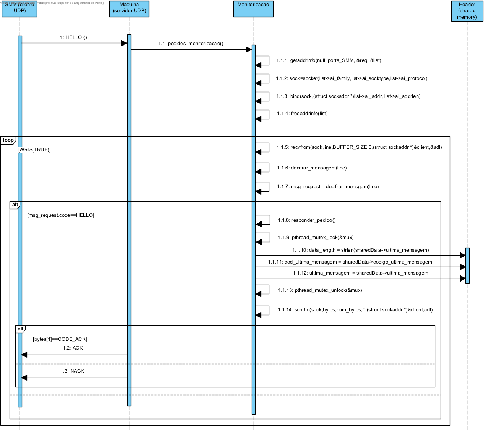

**Maria João Dias [1171865](../)** - Adicionar pedidos de monitorização ao simulador de Máquina
=======================================

# 1. Requisitos

Como Gestor de Projeto, eu pretendo que o simulador de máquina suporte pedidos de monitorização do seu estado.

- comunicação baseada em UDP;
- Deve ser concorrente (em C) com o resto da simulação da máquina e o estado deve ser partilhado entre threads.

# 2. Análise

- (nada a acrescentar)

# 3. Design

## 3.1. Realização da Funcionalidade

# 4. Implementação

- Utilizada uma thread no simulador de máquina para funcinonar como servidor UDP;
- Foi criada uma área de memória partilhada para partilha entre threads do estado da mensagem e a respetiva mensagem;
- De forma a garantir que não existe acesso simultâneo à zona de memória partilhada, utiliza-se um mutex.

[Pedidos de Monitorização](https://bitbucket.org/joaomfas/lei_isep_2019_20_sem4_2na_1181436_1171668_1171865_1190293/src/master/app/simuladormaquina/monitorizacao.c)

# 5. Integração/Demonstração

- Esta US integra o simulador de máquina juntamente com a US1011.

# 6. Observações

Sem observações.
