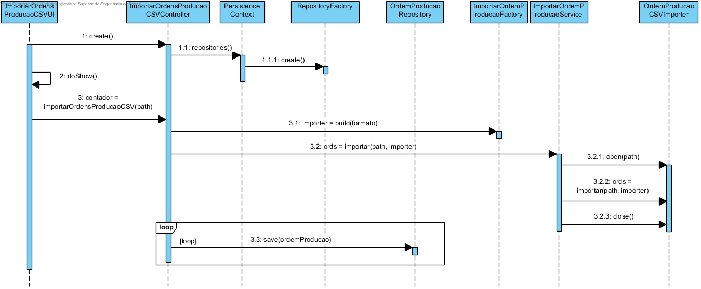

**Maria João Dias [1171865](../)** - Importar ordens de produção através de um ficheiro de CSV
=======================================

# 1. Requisitos

- Como Gestor de Produção, eu pretendo importar ordens de produção através de um ficheiro CSV.
- Existe a liberdade para especificar a estrutura do ficheiro.

# 2. Análise

## 2.1 Regras de Negócio

- Uma ordem de produção é caracterizado por: identificador(Id), data de emissão, data prevista de execução, identificação do produto (ID) e respetiva quantidade, identificação das encomendas(ID) e o estado da ordem de produção.
- Todos os campos deverão ser fornecidos, exceto o estado.
- As ordens de produção têm por defeito o estado PENDENTE.

# 3. Design

## 3.1. Realização da Funcionalidade

## 3.2. Diagrama de Classes

## 3.3. Padrões Aplicados

Aplicar o padrão Repository Factory que permite criar repositórios de forma dinâmica e isolar o controller do US da tecnologia utilizada para a persistência de dados.

Para resolver a questão da importação de Ordens de Produção de um ficheiro CSV deverá recorrer-se ao padrão Strategy. Para este efeito deverá ser criada uma factory OrdemProducaoImporterFactory que detém a responsabilidade de devolver a construir e devolver o importador correto para o tipo de ficheiro passado por parâmetro.
Uma vez que os passos necessários para importar ordens de produção de um ficheiro são sempre os mesmos (abrir o ficheiro, recolher a informação, fechar o ficheiro) o ImportarOrdemProducaoService irá ter um método Template que irá receber o caminho do ficheiro e uma instância de IOrdemProducaoImporter (interface que será implementada por classes responsáveis por importar ordens de produção de ficheiros).
Desta maneira, toda a lógica, desde os passos necessários para importar Ordens de Produção de um ficheiro até à instanciação do importador correto, fica ocultada ao controlador do caso de uso e asseguram o princípio da responsabilidade única.

## 3.4. Testes

**Smoke tests:**
Deverá ser implementado um smoke teste que importe um ficheiro conhecido e de seguida que liste as ordens de produção presentes na BD para garantir que a importação foi bem sucedida.

**Testes manuais:**
Os testes manuais servirão para eliminar possíveis bugs na UI e garantir o correto comportamento da aplicação ao serem inseridos dados inválidos.

# 4. Implementação

[User Interface](https://bitbucket.org/joaomfas/lei_isep_2019_20_sem4_2na_1181436_1171668_1171865_1190293/src/master/app/base.app.backoffice.console/src/main/java/eapli/base/app/backoffice/presentation/ordensproducao/ImportarOrdensProducaoCSVUI.java)

[Controller](https://bitbucket.org/joaomfas/lei_isep_2019_20_sem4_2na_1181436_1171668_1171865_1190293/src/master/app/base.core/src/main/java/eapli/base/gestaoordensproducao/application/ImportarOrdensProducaoCSVController.java)

# 5. Integração/Demonstração

Esta US depende da US2010 de adicionar ordem de produção.
A lista de ordens de produção é obtida através da base de dados.

# 6. Observações

Sem observações
