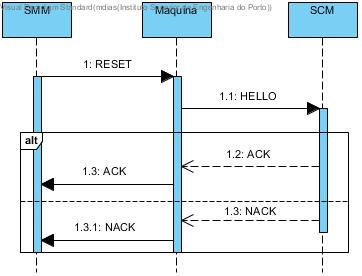
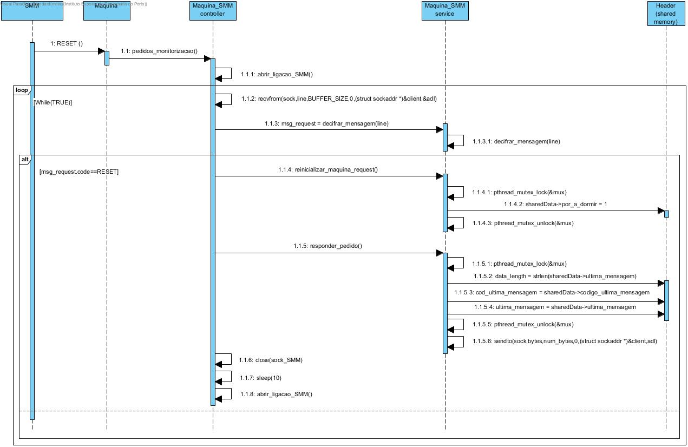
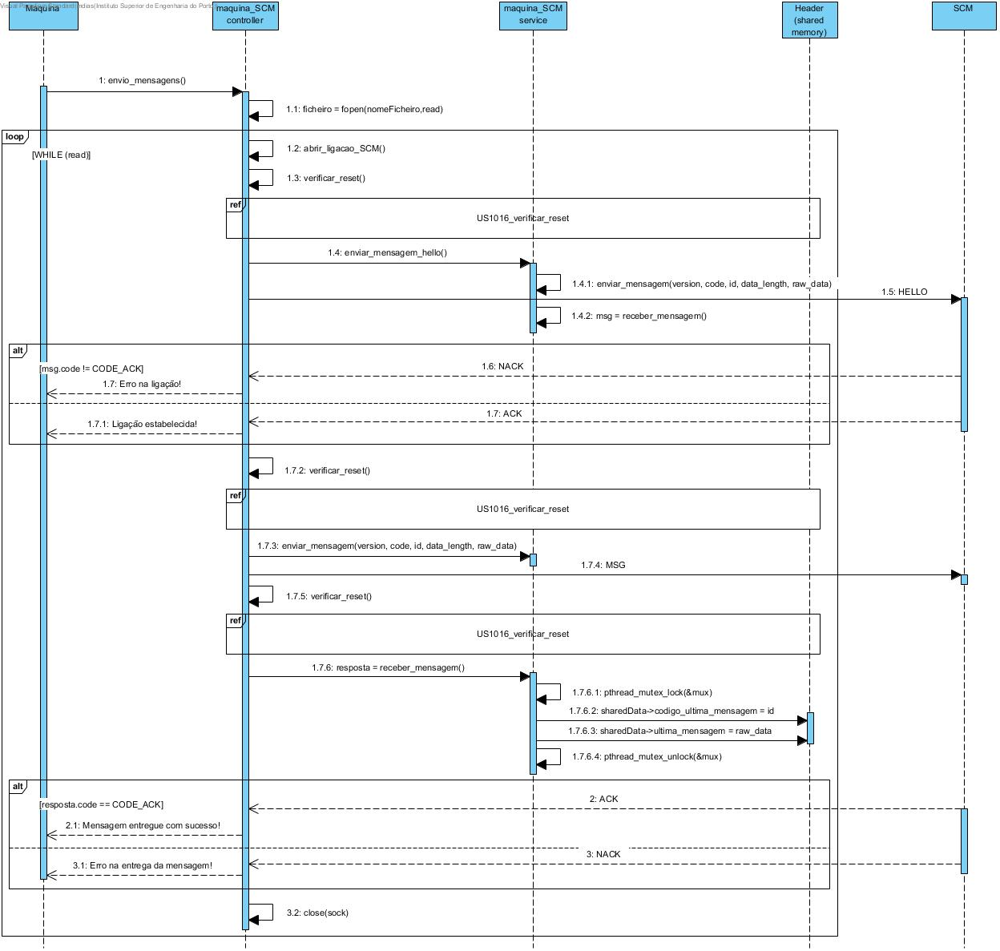
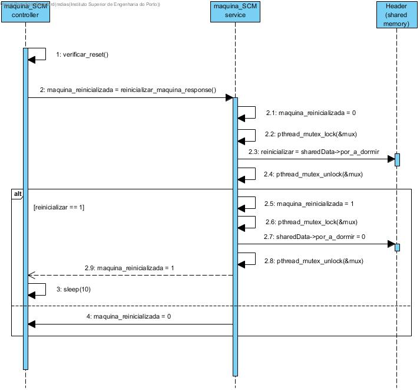

**Maria João Dias [1171865](../)** - Adiconar pedidos de reset de estado ao simulador de Máquina
=======================================

# 1. Requisitos

Como Gestor de Projeto, eu pretendo que o simulador de máquina suporte pedidos de reinicialização (reset) do seu estado.

- Comunicação baseada em UDP e TCP;
- Deve ser concorrente (em C) com o resto da simulação da máquina e o estado deve ser partilhado entre threads;
- Quando uma máquina recebe um pedido de reinicialização, esta começa por interromper (em "segurança" / adequadamente) as atividades/processos em curso (e.g. envio de mensagens) e reinicia-se (i.e. desliga-se e volta a ligar-se);
- Após reiniciar, esta retoma as atividades/processos que tem pendentes (e.g. os que foram interrompidos).

# 2. Análise

- (nada a acrescentar)

# 3. Design

## 3.1. Realização da Funcionalidade

### Visão Geral

### Comunicação com o SMM

### Comunicação com o SCM

#### Interaction use

# 4. Implementação

- Utilizada uma thread no simulador de máquina para funcinonar como servidor UDP e outra para funcionar como servidor TCP;
- Foi criada uma área de memória partilhada para partilha entre threads do estado da mensagem e a respetiva mensagem;
- De forma a garantir que não existe acesso simultâneo à zona de memória partilhada, utiliza-se um mutex;
- Utilizada uma flag na estrutura de memória partilhada para sinalizar o RESET;
- Para simular o desligar e voltar a ligar da áquina, são feitos sleeps de 10 segundos tanto do lado do SMM como do lado do SCM.

[Máquina_SMM Controller](https://bitbucket.org/joaomfas/lei_isep_2019_20_sem4_2na_1181436_1171668_1171865_1190293/src/master/app/simuladormaquina1_withSSL/maquina_SMMcontroller.c)

[Máquina_SCM Controller](https://bitbucket.org/joaomfas/lei_isep_2019_20_sem4_2na_1181436_1171668_1171865_1190293/src/master/app/simuladormaquina1_withSSL/maquina_SCMcontroller.c)

# 5. Integração/Demonstração

- Esta US integra o simulador de máquina e dá resposta ao pedido da US6002.
- Foram criados 2 simuladores de máquinas para uma melhor demonstração das funcionalidades.

# 6. Observações

Sem observações.