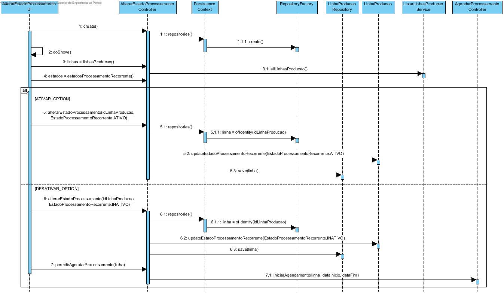
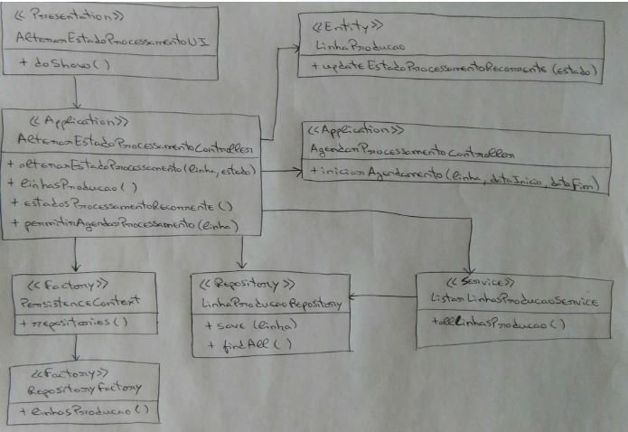

**Maria João Dias [1171865](../)** - Consultar e alterar estado do processamento de mensagens por linha de produção
=======================================

# 1. Requisitos

Como Gestor de Chão de Fábrica, eu pretendo saber e alterar o estado (ativo/desativo) do processamento de mensagens de cada linha de produção bem como conhecer a última vez que o mesmo se realizou.

- A alteração de estado é feita por linha e inclui:
 - (i) ativar/desativar o processamento recorrente de mensagens;
 - (ii) solicitar o (re)processamento de mensagens para um determinado intervalo de tempo.

# 2. Análise

## 2.1 Regras de Negócio

Processamento Ativo: significa que o processamento recorrente de mensagens ocorre ciclicamente.

Processamento Inativo: não ocorre qualquer processamento recorrente. Neste caso, pode ser solicitado o (re)processamento para um determinado intervalo de tempo, devendo este executar e terminar mantendo o estado inativo.

# 3. Design

## 3.1. Realização da Funcionalidade

## 3.2. Diagrama de Classes

## 3.3. Padrões Aplicados

Aplicar o padrão Repository Factory que permite criar repositórios de forma dinâmica e isolar o controller do US da tecnologia utilizada para a persistência de dados.

## 3.4. Testes

**Smoke tests:**
Deverão ser implementados smoke tests para garantir que o processamento retornado pela BD para cada linha de produção se encontra correto.

**Testes manuais:**
Os testes manuais servirão para eliminar possíveis bugs na UI e garantir o correto comportamento da aplicação.

# 4. Implementação

[User Interface](https://bitbucket.org/joaomfas/lei_isep_2019_20_sem4_2na_1181436_1171668_1171865_1190293/src/master/app/base.app.backoffice.console/src/main/java/eapli/base/app/backoffice/presentation/spm/AlterarEstadoProcessamentoUI.java)

[Controller](https://bitbucket.org/joaomfas/lei_isep_2019_20_sem4_2na_1181436_1171668_1171865_1190293/src/master/app/base.core/src/main/java/eapli/base/spm/application/AlterarEstadoProcessamentoController.java)

# 5. Integração/Demonstração

Esta US depende da US5002 responsável por efetuar o processamento de mensagens.

# 6. Observações

Sem observações.
