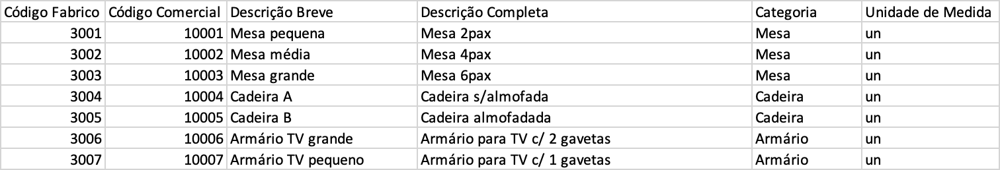

**João Ferreira [1181436](../)** - Inicialização (bootstrap) de alguns produtos
=======================================

# 1. Requisitos

- Como Gestor de Projeto, eu pretendo que a equipa proceda à inicialização (bootstrap) de alguns produtos.
- Não inclui a definição da Ficha de Produção.

# 2. Análise

## 2.1 Regras de Negócio

- Um produto é caracterizado por: código ÚNICO de fabrico, código ÚNICO comercial, descrição breve e descrição completa e ainda pelas unidades de medida que serão utilizadas para este produto.
- Todos os campos deverão ser fornecidos.

# 3. Integração/Demonstração

Para a inicialização de Produtos, apesar de não existir uma dependência direta com nenhuma das outras entidades existentes, deverá ser feita uma coordenação com o responsável pelo bootstrap das matérias primas. Para que os Produtos existentes façam sentido no contexto das Matérias Primas carregadas no bootstrap.

# 6. Observações

