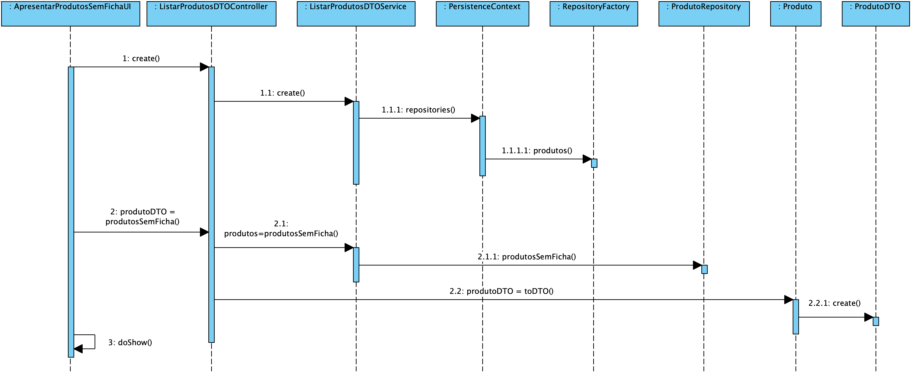
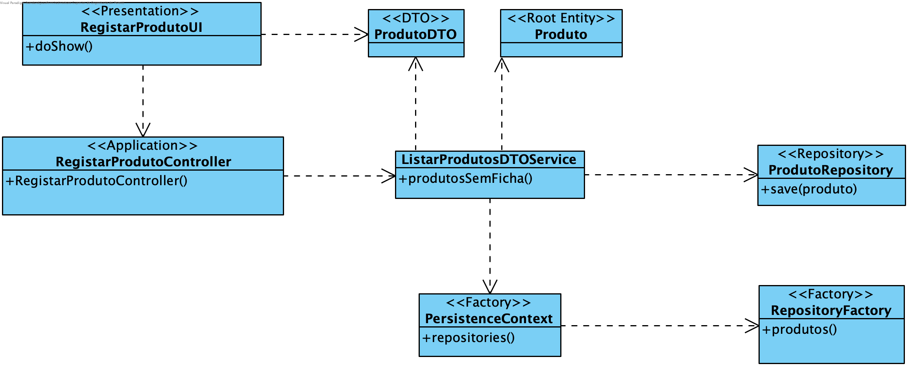

**João Ferreira [1181436](../)** - Consultar os produtos que não têm Ficha de Produção definida
=======================================

# 1. Requisitos

- Como Gestor de Produção, eu quero consultar os produtos que não têm Ficha de Produção definida.

# 2. Análise

## 2.1 Regras de Negócio

- Os Produtos quando adicionados ao sistema não possuem uma Ficha de Produção definida. Sendo necessário a sua adição posterior. Esta listagem permite identificar os Produtos que não possuem Ficha de Produção Definida.

# 3. Design

## 3.1. Realização da Funcionalidade

## 3.2. Diagrama de Classes

## 3.3. Padrões Aplicados

Aplicar o padrão Repository Factory que permite criar repositórios de forma dinâmica e isolar o controller do US da tecnologia utilizada para a persistência de dados.

Recorrer a DTOs (Data Transfer Objects). Estes não são considerados objetos de domínio e são usados como contentores de dados. Neste caso, serão utilizados para armazenar a informação proveniente da query à BD.

## 3.4. Testes

**Smoke tests:**
Deverão ser inseridos Produtos na BD e de seguida pedir a listagem de Produtos sem Ficha de Produção. A lista terá de conter os Produtos inseridos uma vez que aquando a sua inserção a Ficha de Produção não é definida.

**Testes manuais:**
Os testes manuais servirão para eliminar possíveis bugs na UI.

# 4. Implementação
## 4.2. User Interface

	@Override
	protected Iterable<ProdutoDTO> elements() {
		return this.theController.produtosSemFicha();
	}

	@Override
	protected Visitor<ProdutoDTO> elementPrinter() {
		return new ProdutoDTOPrinter();
	}

	@Override
	protected String elementName() {
		return "Produtos sem ficha de produção";
	}

	@Override
	protected String listHeader() {
		return String.format("%-25s%-25s%-30s", "Código de Fabrico", "Código Comercial", "Descrição Completa");
	}

## 4.2. Controller

	public Iterable<ProdutoDTO> produtosSemFicha() {
		return this.svc.produtosSemFicha();
	}

## 4.3 DTO Service

	public Iterable<ProdutoDTO> produtosSemFicha() {
		authz.ensureAuthenticatedUserHasAnyOf(BaseRoles.POWER_USER, BaseRoles.GESTOR_PRODUCAO);
		final Iterable<Produto> produtos = this.dishRepository.produtosSemFichaProducao();
		final List<ProdutoDTO> ret = new ArrayList<>();
		produtos.forEach(e -> ret.add(e.toDTO()));
		return transformToDTO(produtos);
	}

	private Iterable<ProdutoDTO> transformToDTO(final Iterable<Produto> produtosSemFicha) {
		final List<ProdutoDTO> ret = new ArrayList<>();
		produtosSemFicha.forEach(e -> ret.add(e.toDTO()));
		return ret;
	}

# 5. Integração/Demonstração

Para a utlização de DTOs foi necessário que a classe de domínio Produto implementasse a interface DTOable e, consequentemente, o método toDTO(). Isto permitiu a criação de objetos ProdutoDTO para a apresentação dos dados que originaram na query à BD.

# 6. Observações

Futuramente a função transformToDTO() poderia ser tornada genérica uma vez que a Estratégia de conversão de objetos de domínio para DTO é sempre a mesma. Uma vez que um objeto de domínio que implemente a interface DTOable tem de implementar a função toDTO(). Isto poderá ser feito caso o nome do DTO referente a um determinado objeto de domínio tenha sempre o mesmo nome que este mas terminado em DTO (ex: o DTO do objeto Produto denomina-se ProdutoDTO).
