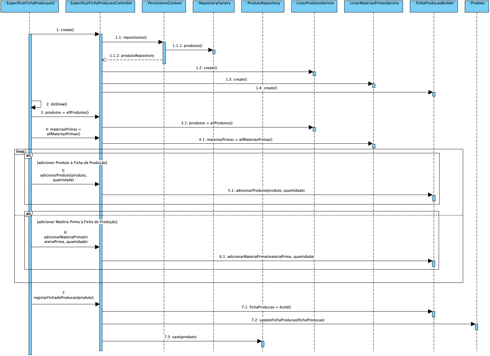
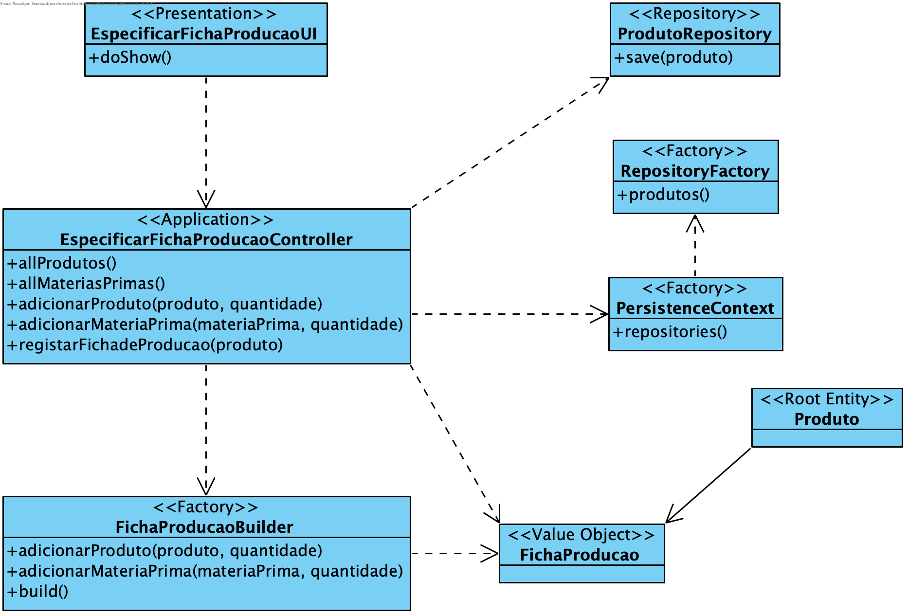

**João Ferreira [1181436](../)** - Especificar a Ficha de Produção de um dado produto
=======================================

# 1. Requisitos

- Como Gestor de Produção, eu pretendo especificar a Ficha de Produção de um dado produto.
- A Ficha de Produção pode indicar Matérias Primas ou outros Produtos.

# 2. Análise

## 2.1 Regras de Negócio

- As necessidades para a produção de um produto são estabelecidas na Ficha de Produção.
- As quantidades indicadas devem ter unidades de medida.
- É necessário usar as Unidades de Medida referentes a cada Produto/Matéria Prima.

# 3. Design

## 3.1. Realização da Funcionalidade

## 3.2. Diagrama de Classes

## 3.3. Padrões Aplicados

Aplicar o padrão Repository Factory que permite criar repositórios de forma dinâmica e isolar o controller do US da tecnologia utilizada para a persistência de dados.

Aplicar o padrão Builder para a construção do objeto Ficha de Produção. Uma vez que este é um objeto que apresenta alguma complexidade e também para garantir que o controlador nunca tem acesso a uma instância de Produto "inacabada".

## 3.4. Testes

**Testes unitários:**
Deverão ser implementados testes que verifiquem as regras de negócios:
- Nenhum dos parâmetros de Componente ou Ficha de Produção podem ser nulos;
- A unidada de medida utilizada tem de ser válida
- As quantidade têm de ser positivas

**Testes manuais:**
Os testes manuais servirão para eliminar possíveis bugs na UI e garantir o correto comportamento da aplicação ao serem inseridos dados inválidos.

# 4. Implementação
## 4.2. User Interface

	@Override
    protected boolean doShow() {
        final Iterable<Produto> produtos = this.theController.allProdutos();
        final Iterable<MateriaPrima> materiasPrimas = this.theController.allMateriasPrimas();

        if (((ArrayList<Produto>) produtos).isEmpty()) {
            System.out.println("Não existem produtos registados.");
            return false;
        }

        System.out.printf("%-25s%-30s%-20s%-20s", "Código de Fabrico",
                "Descrição Completa", "Ficha de Produção", "Unidade de Medida");
        final SelectWidget<Produto> selector = new SelectWidget<>("", produtos,
                new ProdutosPrinter());
        selector.show();

        if (selector.selectedOption() == EXIT_OPTION) {
            return false;
        }

        final Produto produto = selector.selectedElement();

        ((ArrayList<Produto>) produtos).remove(produto);

        int opcao = -1;

        List<String> options = new ArrayList<>();
        options.add("Produto");
        options.add("Matéria Prima");
        options.add("Concluir");

        while (opcao != CONCLUIR_OPTION) {
            final SelectWidget<String> selectorOption = new SelectWidget<>("Componente:", options,
                    new OptionPrinter());
            selectorOption.show();

            opcao = selectorOption.selectedOption();

            switch (opcao) {
                case PRODUTO_OPTION:
                    if (!adicionarProduto(theController, produtos)) {
                        return false;
                    }
                    break;
                case MP_OPTION:
                    if (!adicionarMateriaPrima(theController, materiasPrimas)) {
                        return false;
                    }
                    break;
                case EXIT_OPTION:
                    return false;
                default:
                    break;
            }
        }

        try {
            this.theController.registarFichaProducao(produto);
        } catch (@SuppressWarnings("unused") final Exception e) {
            System.out.println(e.getMessage());
        }

        return false;
    }

    private boolean adicionarProduto(RegistarFichaProducaoController theController, Iterable<Produto> produtos) {
        System.out.printf("%-25s%-30s%-20s%-20s", "Código de Fabrico",
                "Descrição Completa", "Ficha de Produção", "Unidade de Medida");
        final SelectWidget<Produto> selector = new SelectWidget<>("", produtos,
                new ProdutosPrinter());
        selector.show();

        if (selector.selectedOption() == EXIT_OPTION) {
            return false;
        }

        Produto produtoComponente = selector.selectedElement();

        if (produtoComponente != null) {
            final Long quantidade = Long.parseLong(Console.readLine("Quantidade (unidade de medida = " + produtoComponente.unidadeMedida() + "):"));
            theController.adicionarProduto(produtoComponente, quantidade);
            return true;
        }

        return false;
    }

    private boolean adicionarMateriaPrima(RegistarFichaProducaoController theController, Iterable<MateriaPrima> materiasPrimas) {
        System.out.printf("%-25s%-25s%-30s%-20s", "Código", "Descrição",
                "Categoria", "Unidade de medida");
        final SelectWidget<MateriaPrima> selector = new SelectWidget<>("", materiasPrimas,
                new MateriaPrimaPrinter());
        selector.show();

        if (selector.selectedOption() == EXIT_OPTION) {
            return false;
        }

        MateriaPrima materiaPrimaComponente = selector.selectedElement();

        if (materiaPrimaComponente != null) {
            final Long quantidade = Long.parseLong(Console.readLine("Quantidade (unidade de medida = " + materiaPrimaComponente.unidadeMedida() + "):"));
            theController.adicionarMateriaPrima(materiaPrimaComponente, quantidade);
            return true;
        }

        return false;
    }

## 4.2. Controller

	public FichaProducao registarFichaProducao(Produto produto) {
        authz.ensureAuthenticatedUserHasAnyOf(BaseRoles.GESTOR_PRODUCAO, BaseRoles.POWER_USER);

        try {
            FichaProducao fichaProducao = builder.build();
            produto.updateFichaProducao(fichaProducao);
            this.repository.save(produto);
            return fichaProducao;
        } catch (Exception e) {
            System.out.println(e.getMessage());
            return null;
        }
    }

    public void adicionarProduto(Produto produto, Long quantidade){
        builder.adicionarProduto(produto, quantidade);
    }

    public void adicionarMateriaPrima(MateriaPrima materiaPrima, Long quantidade){
        builder.adicionarMateriaPrima(materiaPrima, quantidade);
    }

    public Iterable<Produto> allProdutos() {
        return this.svcProdutos.allProdutos();
    }

    public Iterable<MateriaPrima> allMateriasPrimas(){
        return this.svcMP.allMateriasPrimas();
    }

## 4.2. Ficha de Produção Builder

	public FichaProducaoBuilder adicionarProduto(Produto item, Long quantidade){
        Componente componente = new Componente(item, quantidade);
        listaComponentes.add(componente);
        return this;
    }

    public FichaProducaoBuilder adicionarMateriaPrima(MateriaPrima item, Long quantidade){
        Componente componente = new Componente(item, quantidade);
        listaComponentes.add(componente);
        return this;
    }

    public FichaProducao build(){
        FichaProducao fichaProducao = new FichaProducao();
        listaComponentes.forEach((comp) -> {
            fichaProducao.addComponente(comp);
        });
        return fichaProducao;
    }

# 5. Integração/Demonstração

A implementação desta US irá integrar Matérias Primas e Produtos.

# 6. Observações

Sem observações.
