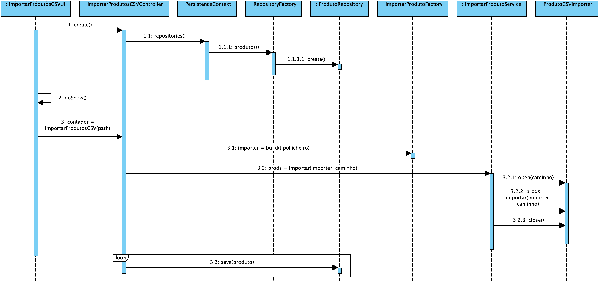
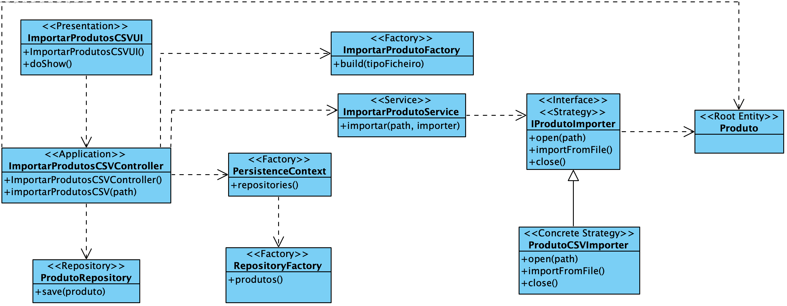

**João Ferreira [1181436](../)** - Importar o catálogo de produtos através de um ficheiro de CSV
=======================================

# 1. Requisitos

- Como Gestor de Produção, eu pretendo importar o catálogo de produtos através de um ficheiro de CSV.
- Não inclui a definição da Ficha de Produção.
- Deve ser criado um ficheiro com as linhas que originaram erros.

# 2. Análise

## 2.1 Regras de Negócio

- Um produto é caracterizado por: código ÚNICO de fabrico, código ÚNICO comercial, descrição breve e descrição completa e ainda pelas unidades de medida que serão utilizadas para este produto.
- Todos os campos deverão ser fornecidos.
- Os produtos importados não irão ter a Ficha de Produção definida.

# 3. Design

## 3.1. Realização da Funcionalidade

## 3.2. Diagrama de Classes

## 3.3. Padrões Aplicados

Aplicar o padrão Repository Factory que permite criar repositórios de forma dinâmica e isolar o controller do US da tecnologia utilizada para a persistência de dados.

Para resolver a questão da importação de Produtos de um ficheiro CSV deverá recorrer-se ao padrão Estratégia. Para este efeito deverá ser criada uma factory ProdutoImporterFactory que detém a responsabilidade de devolver a construir e devolver o importador correto para o tipo de ficheiro passado por parâmetro.
Uma vez que os passos necessários para importar produtos de um ficheiro são sempre os mesmos (abrir o ficheiro, recolher a informação, fechar o ficheiro) o ImportarProdutoService irá ter um método Template que irá receber o caminho do ficheiro e uma instância de IProdutoImporter (interface que será implementada por classes responsáveis por importar produtos de ficheiros).
Desta maneira, toda a lógica (desde os passos necessários para importar Produtos de um ficheiro até à instanciação do importador correto) ficam ocultados ao controlador do caso de uso e asseguram o princípio da responsabilidade única.

## 3.4. Testes

**Smoke tests:**
Deverá ser implementado um smoke teste que importe um ficheiro conhecido e de seguida que liste os produtos presentes na BD para garantir que a importação foi bem sucedida.

**Testes manuais:**
Os testes manuais servirão para eliminar possíveis bugs na UI e garantir o correto comportamento da aplicação ao serem inseridos dados inválidos.

# 4. Implementação
## 4.2. User Interface

	protected boolean doShow() {
		final String path = Console.readLine("Caminho do ficheiro CSV:");    
		try {
			int contador = this.theController.importarProdutosCSV(System.getProperty("user.home")+path);
			System.out.println("Foram importados "+contador+" produtos!");
		} catch (@SuppressWarnings("unused") final IntegrityViolationException e) {
			System.out.println("Erro ao importar produtos!");
		}
			return false;
    }

## 4.2. Controller

	public int importarProdutosCSV(final String path) {
		int contador = 0;
		authz.ensureAuthenticatedUserHasAnyOf(BaseRoles.GESTOR_PRODUCAO);
		try {
			final IProdutoImporter exporter = factory.build(TipoFicheiroImporter.CSV);
			Iterable<Produto> prods = importCsv.importar(path, exporter);
			for (Produto prod : prods) {
				repository.save(prod);
				contador++;
			}
		return contador;
		} catch (Exception e) {
			System.out.println(e.getMessage());
			return 0;
		}
	}

## 4.3. Enumerador com os tipos de ficheiros aceites

	public enum TipoFicheiroImporter {
	    CSV
	}

## 4.4. Factory para importadores de produtos

	public final IProdutoImporter build(TipoFicheiroImporter tipo){

		switch (tipo) {
			case CSV:
				return new CSVProdutoImporter();
			}
			throw new IllegalStateException("Formato desconhecido!");
		}

## 4.5. Serviço para Importação de Produtos

	public Iterable<Produto> importar(String path, IProdutoImporter importer) throws IOException {
		try {
			importer.open(path);
			Iterable<Produto> produtos = importer.importFromFile();
			importer.close();
			return produtos;
		} catch (final IOException e) {
			logger.error("Problem exporting dishes", e);
			throw e;
		}
	}

## 4.6. Interface para os importadores de produtos

	public interface IProdutoImporter {
		void open(String path) throws FileNotFoundException;
		Iterable<Produto> importFromFile() throws IOException;
		void close() throws IOException;
	}

## 4.7. Importador de produtos de um ficheiro CSV

	private BufferedReader leitor;
	private ProdutoBuilder builder = new ProdutoBuilder();

	@Override
	public void open(String path) throws FileNotFoundException {
		leitor = new BufferedReader(new FileReader(path));
	}

	@Override
	public Iterable<Produto> importFromFile() throws IOException {
		String sepparator = Application.settings().getCSVSeparator();
		List<Produto> prods = new ArrayList<>();
		boolean cabecalho = true;
		String linha;
		String[] info;

		linha = leitor.readLine();

		while (linha != null) {
			if (!cabecalho) {
				info = linha.split(sepparator);
				final String codigoFabrico = info[0].trim();
				final String codigoComercial = info[1].trim();
				final String descBreve = info[2].trim();
				final String descCompleta = info[3].trim();
				final String unidadeMedida = info[4].trim();
				final String catProduto = info[5].trim();

				prods.add(builder.comCodigoFabrico(codigoFabrico).comCodigoComercial(codigoComercial).comDescricaoBreve(descBreve).comDescricaoCompleta(descCompleta).comCategoria(catProduto).comUnidadeMedida(unidadeMedida).build());
			}
			linha = leitor.readLine();
			cabecalho = false;
		}
		return prods;
	}

	@Override
	public void close() throws IOException {
		leitor.close();
	}

# 5. Integração/Demonstração

Para a criação de objetos, o importador recorre ao builder previamente desenvolvimento para a criação de objetos de domínio do tipo Produto.

# 6. Observações

Caso seja necessário desenvolver importadores de outros tipo de ficheiro o enumerados TipoFicheiroImporter deverá ser devidamente atualizado.
