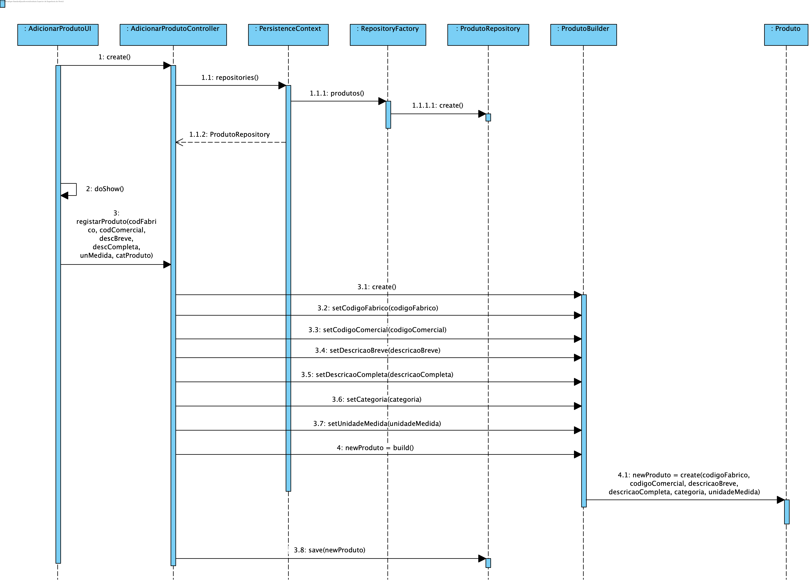
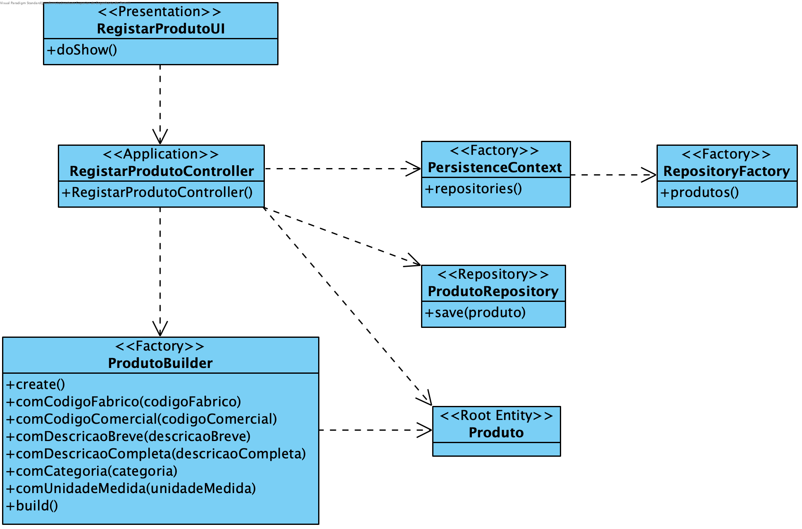

**João Ferreira [1181436](../)** - Adicionar um novo Produto ao catálogo de Produtos
=======================================

# 1. Requisitos

- Como Gestor de Produção, pretendo adicionar um novo produto ao catálogo de produtos.
- Não inclui a definição da Ficha de Produção.

# 2. Análise

## 2.1 Regras de Negócio

- Um produto é caracterizado por: código ÚNICO de fabrico, código ÚNICO comercial, descrição breve e descrição completa e ainda pelas unidades de medida que serão utilizadas para este produto
- Todos os campos deverão ser fornecidos
- O Gestor de Produção quando cria um novo produto não cria a respetiva Ficha de Produção

# 3. Design

## 3.1. Realização da Funcionalidade

## 3.2. Diagrama de Classes

## 3.3. Padrões Aplicados

Aplicar o padrão Repository Factory que permite criar repositórios de forma dinâmica e isolar o controller do US da tecnologia utilizada para a persistência de dados.

Aplicar o padrão Builder para a construção do objeto Produto. Uma vez que este é um objeto que apresenta alguma complexidade e também para garantir que o controlador nunca tem acesso a uma instância de Produto "inacabada".

## 3.4. Testes

**Testes unitários:**
Deverão ser implementados testes que verifiquem as regras de negócios:
- Nenhum dos parâmetros de Produto pode ser nulo;
- Os value objects que compõem produto não podem ter dados vazios
- A unidada de medida utilizada tem de ser válida

**Smoke tests:**
Deverão ser implementados testes CRUD (Create, Read, Update, Delete) para garantir o correto funcionamento do mecanismo de persistência dos dados:
- Gravar dados
- Aceder a produtos pelo seu Código de Fabrico
- Apagar produtos pelo seu Código de Fabrico

**Testes manuais:**
Os testes manuais servirão para eliminar possíveis bugs na UI e garantir o correto comportamento da aplicação ao serem inseridos dados inválidos.

# 4. Implementação
## 4.2. User Interface

	protected boolean doShow() {
		final String codigoFabrico = Console.readLine("Código Fabrico:");
		final String codigoComercial = Console.readLine("Código Comercial:");
		final String descBreve = Console.readLine("Descrição Breve:");
		final String descCompleta = Console.readLine("Descrição Completa:");
		final String catProduto = Console.readLine("Categoria do Produto:");
		final String unidadeMedida = Console.readLine("Unidade de Medida:");

		try {
			this.theController.registarProduto(codigoFabrico, codigoComercial, descBreve, descCompleta, catProduto, unidadeMedida);
		} catch (@SuppressWarnings("unused") final IntegrityViolationException e) {
			System.out.println("Erro ao registar produto!");
		}
		return false;
	}

## 4.2. Controller

	public Produto registarProduto(final String codigoFabrico, final String codigoComercial,
		final String descricaoBreve, final String descricaoCompleta, final String categoria, final String unMedida) {
			authz.ensureAuthenticatedUserHasAnyOf(BaseRoles.GESTOR_PRODUCAO);
		try {
			final ProdutoBuilder produtoBuilder = new ProdutoBuilder();
			produtoBuilder.comCodigoFabrico(codigoFabrico).comCodigoComercial(codigoComercial).comDescricaoBreve(descricaoBreve).comDescricaoCompleta(descricaoCompleta).comCategoria(categoria).comUnidadeMedida(unMedida);
			return this.repository.save(produtoBuilder.build());
		} catch (Exception e) {
			System.out.println(e.getMessage());
			return null;
		}
	}

## 4.3. Produto Builder

	public ProdutoBuilder comCodigoFabrico(final String codigoFabrico) {
        this.codigoFabrico = new CodigoFabrico(codigoFabrico);
        return this;
    }

    public ProdutoBuilder comCodigoComercial(final String codigoComercial) {
        this.codigoComercial = new CodigoComercial(codigoComercial);
        return this;
    }

    public ProdutoBuilder comDescricaoBreve(final String descricaoBreve) {
        this.descricaoBreve = new DescricaoBreve(descricaoBreve);
        return this;
    }

    public ProdutoBuilder comDescricaoCompleta(final String descricaoCompleta) {
        this.descricaoCompleta = new DescricaoCompleta(descricaoCompleta);
        return this;
    }

    public ProdutoBuilder comCategoria(final String categoria) {
        this.categoria = categoria;
        return this;
    }

    public ProdutoBuilder comUnidadeMedida(final String unidadeMedida) {
        this.unidadeMedida = new UnidadeMedida(unidadeMedida);
        return this;
    }

    @Override
    public Produto build() {
        return new Produto(codigoFabrico, codigoComercial, descricaoBreve, descricaoCompleta, categoria, unidadeMedida);
    }

# 5. Integração/Demonstração

Para a implementação das Unidades de Medida recorreu-se ao package javax.measure [(+documentação)](https://www.baeldung.com/javax-measure).

# 6. Observações

Sem observações.
