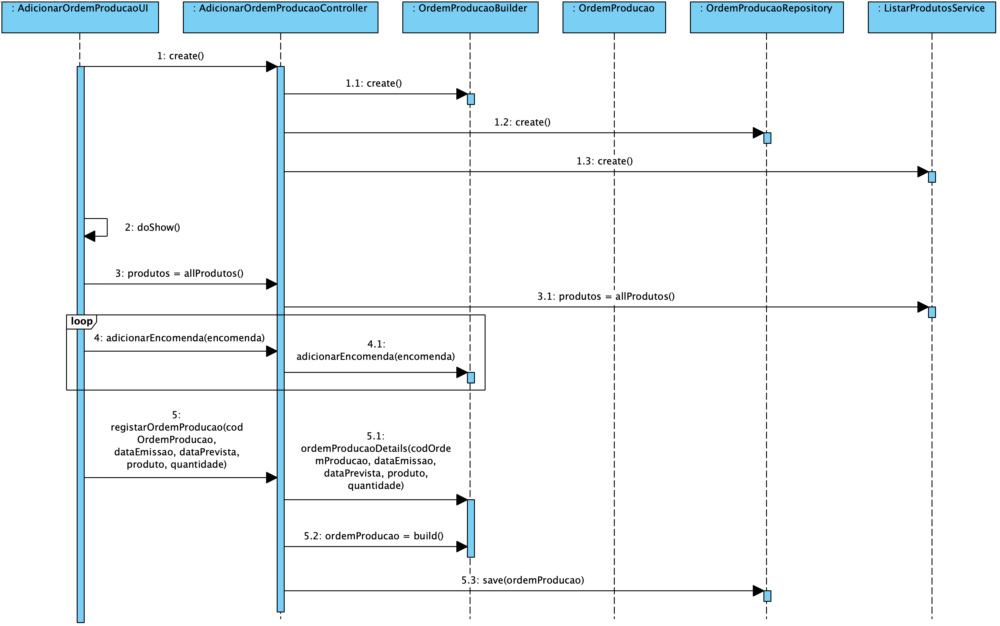
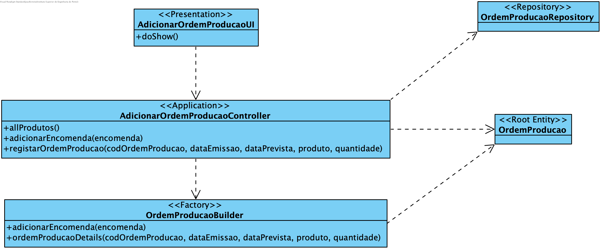

**João Ferreira [1181436](../)** - Introduzir manualmente uma nova ordem de produção
=======================================

# 1. Requisitos

- Como Gestor de Produção, eu pretendo introduzir manualmente uma nova ordem de produção.Como Gestor de Produção, eu pretendo introduzir manualmente uma nova ordem de produção.

# 2. Análise

## 2.1 Regras de Negócio

- Para instanciar uma Ordem de Produção é necessário: código ÚNICO, produto a produzir e respetiva quantidade, data de emissão, data prevista de término e pela lista de encomendas a que a Ordem de Produção está a dar resposta
- Todos os campos deverão ser fornecidos

# 3. Design

## 3.1. Realização da Funcionalidade

## 3.2. Diagrama de Classes

## 3.3. Padrões Aplicados

Aplicar o padrão Repository Factory que permite criar repositórios de forma dinâmica e isolar o controller do US da tecnologia utilizada para a persistência de dados.

Aplicar o padrão Builder para a construção do objeto Ordem de Produção. Uma vez que este objeto possui uma lista de Encomendas foi utilizado este padrão para garantir que o controlador nunca tem acesso a uma instância de Ordem de Produção "inacabada".

## 3.4. Testes

**Testes unitários:**
Deverão ser implementados testes que verifiquem as regras de negócios:
- Nenhum dos parâmetros iniciais de Ordem de Produção pode ser nulo;
- Os value objects que compõem produto não podem ter dados vazios;
- As datas têm de estar no formato válido;
- A data prevista não pode ser no passado.

**Smoke tests:**
Deverão ser implementados testes CRUD (Create, Read, Update, Delete) para garantir o correto funcionamento do mecanismo de persistência dos dados:
 - Gravar dados;
 - Aceder a Ordens de Produção pelo seu Código;
 - Apagar Ordens de Produção pelo seu Código.

**Testes manuais:**
Os testes manuais servirão para eliminar possíveis bugs na UI e garantir o correto comportamento da aplicação ao serem inseridos dados inválidos.

# 4. Implementação
[User Interface](https://bitbucket.org/joaomfas/lei_isep_2019_20_sem4_2na_1181436_1171668_1171865_1190293/src/master/app/base.app.backoffice.console/src/main/java/eapli/base/app/backoffice/presentation/ordensproducao/AdicionarOrdemProducaoUI.java)

[Controller](https://bitbucket.org/joaomfas/lei_isep_2019_20_sem4_2na_1181436_1171668_1171865_1190293/src/master/app/base.core/src/main/java/eapli/base/gestaoordensproducao/application/AdicionarOrdemProducaoController.java)

[Ordem de Produção Builder](https://bitbucket.org/joaomfas/lei_isep_2019_20_sem4_2na_1181436_1171668_1171865_1190293/src/master/app/base.core/src/main/java/eapli/base/gestaoordensproducao/domain/OrdemProducaoBuilder.java)

# 5. Integração/Demonstração

Apesar de não ser necessário para este US, deverá também já ser implementada tudo o que diz respeito à Execução de Ordem de Produção por uma questão de dependências de US seguintes.

# 6. Observações

Sem observações.
