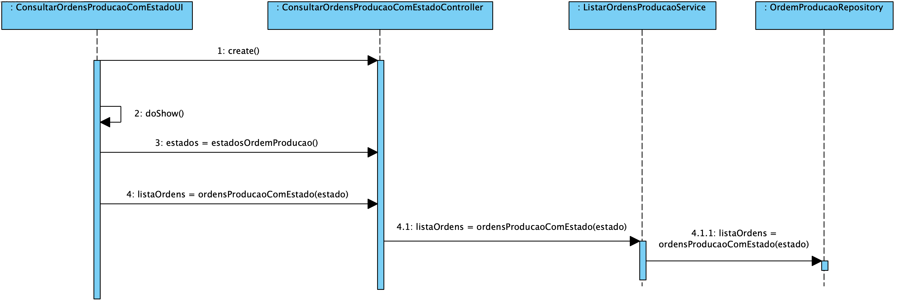
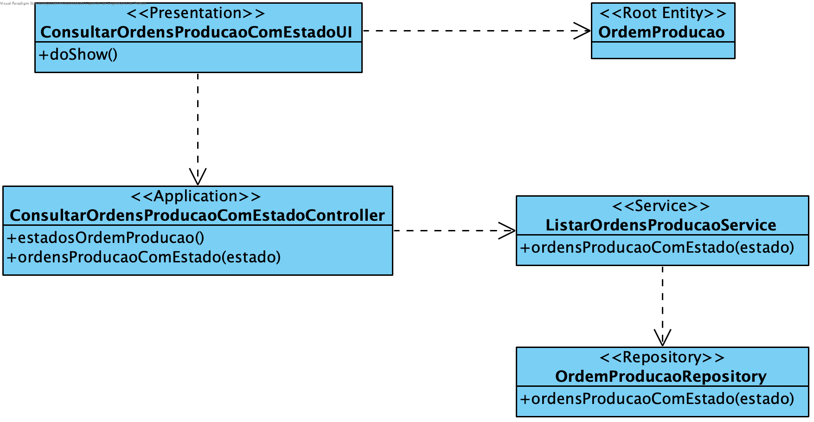

**João Ferreira [1181436](../)** - Consultar ordens de produção que estão num determinado estado
=======================================

# 1. Requisitos

- Como Gestor de Produção, eu pretendo consultar as ordens de produção que estão num determinado estado (e.g. em execução). Deve permitir consultar o detalhe de cada ordem de produção.

# 2. Análise

## 2.1 Regras de Negócio

- As Ordens de Produção possuem 3 estados possíveis: pendente, execução e pendente.

# 3. Design

## 3.1. Realização da Funcionalidade

## 3.2. Diagrama de Classes

## 3.3. Padrões Aplicados

Aplicar o padrão Repository Factory que permite criar repositórios de forma dinâmica e isolar o controller do US da tecnologia utilizada para a persistência de dados.

Para se poder isolar mais eficazmente a camada de Apresentação da camada de Domínio poderão ser utilizados DTO. No entanto, por motivos de poupança de tempo, os mesmos poderão não ser implementados neste momento.

## 3.4. Testes

**Smoke tests:**
Deverão ser implementados smoke tests para garantir que as listas retornadas pela BD para cada estado se encontram corretas.

**Testes manuais:**
Os testes manuais servirão para eliminar possíveis bugs na UI e garantir o correto comportamento da aplicação.

# 4. Implementação
[User Interface](https://bitbucket.org/joaomfas/lei_isep_2019_20_sem4_2na_1181436_1171668_1171865_1190293/src/master/app/base.app.backoffice.console/src/main/java/eapli/base/app/backoffice/presentation/ordensproducao/OrdensProducaoComEstadoUI.java)

[Controller](https://bitbucket.org/joaomfas/lei_isep_2019_20_sem4_2na_1181436_1171668_1171865_1190293/src/master/app/base.core/src/main/java/eapli/base/gestaoordensproducao/application/OrdensProducaoComEstadoController.java)

# 5. Integração/Demonstração

A filtragem da listagem das Ordens de Produção pelo seu estado deverá ser feito pela BD.

# 6. Observações

Sem observações.
