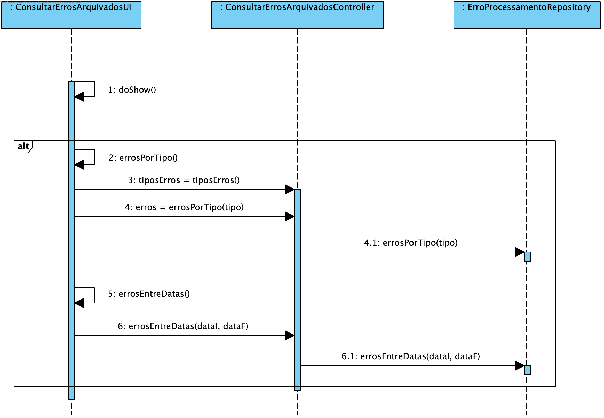
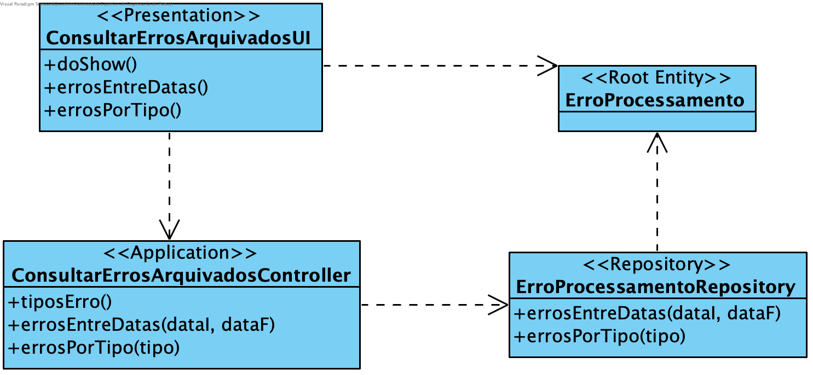

**João Ferreira [1181436](../)** - Consultar as notificações de erros de processamento arquivadas
=======================================

# 1. Requisitos

- Como Gestor de Chão de Fábrica, eu pretendo consultar as notificações de erros de processamento arquivadas.
- O sistema deve disponibilizar vários filtros.

# 2. Análise

## 2.1 Regras de Negócio

- Os erros de processamento têm dois estados: pendente e arquivado
- Os erros de processamento possuem uma data de geração
- Os erros possuem diferentes tipos consoante o problema que levou à sua geração

# 3. Design

## 3.1. Realização da Funcionalidade

## 3.2. Diagrama de Classes

## 3.3. Padrões Aplicados

Aplicar o padrão Repository Factory que permite criar repositórios de forma dinâmica e isolar o controller do US da tecnologia utilizada para a persistência de dados.

## 3.4. Testes

**Testes funcionais:**
Realizar testes funcionais para garantir o correto funcionamento da UI e a validade dos resultados vindos da BD.

# 4. Implementação

[User Interface](https://bitbucket.org/joaomfas/lei_isep_2019_20_sem4_2na_1181436_1171668_1171865_1190293/src/master/app/base.app.backoffice.console/src/main/java/eapli/base/app/backoffice/presentation/gestaoerros/ConsultarErrosArquivadosUI.java)

[Controller](https://bitbucket.org/joaomfas/lei_isep_2019_20_sem4_2na_1181436_1171668_1171865_1190293/src/master/app/base.core/src/main/java/eapli/base/gestaoordensproducao/application/ConsultarErrosArquivadosPorTipoController.java)

# 5. Integração/Demonstração

Sem observações.

# 6. Observações

Sem observações.
