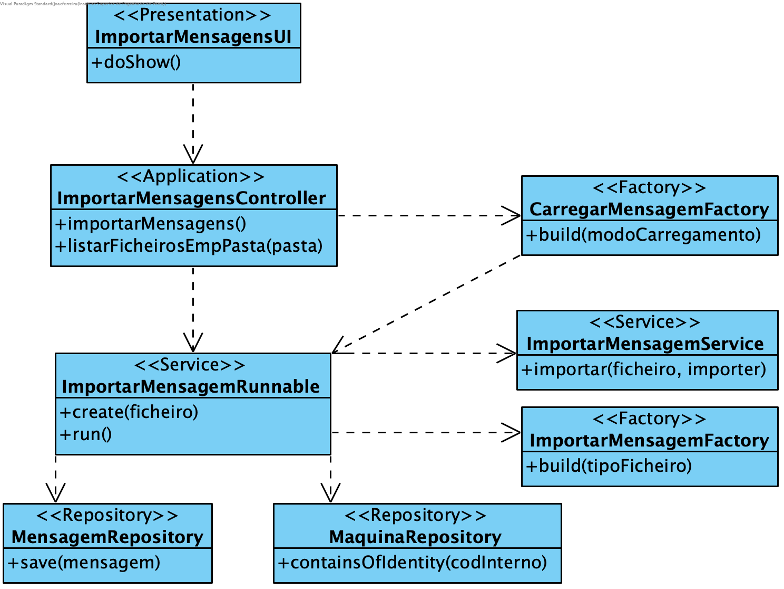

**João Ferreira [1181436](../)** - Importar mensagens de ficheiros de texto
=======================================

# 1. Requisitos

- Como Serviço de Comunicação com as Máquinas (SCM), pretendo importar, de forma concorrente/paralela, as mensagens existentes nos ficheiros de texto presentes no diretório de entrada de forma a disponibilizar as mesmas para processamento.

# 2. Análise

## 2.1 Regras de Negócio

- As mensagens têm de ser de uma máquina existente no Sistema.
- A aplicação deve utilizar threads para a importação paralela dos ficheiros
- Após importação, os ficheiros devem ser transferidos para um diretório de ficheiros processados.

# 3. Design

## 3.1. Realização da Funcionalidade

## 3.2. Diagrama de Classes

## 3.3. Padrões Aplicados

Aplicar o padrão Repository Factory que permite criar repositórios de forma dinâmica e isolar o controller do US da tecnologia utilizada para a persistência de dados.

A implementação deste US passará pela implementação de dois padrões Estratégia distintos: um para o modo de recepção de mensagens (neste caso, por ficheiro) e outro para o tipo de ficheiro que irá ser analisado. Para este efeito deverá ser cria uma factory MensagemImporterFactory CarregarMensagemFacotry que detém a responsabilidade de devolver a construir e devolver o importador correto para o modo de recepção de mensagens (passado por parâmetro). E, deverá ainda ser criada uma factory que detém a a responsabilidade de devolver a construir e devolver o importador correto para o tipo de ficheiro a analisar (passado por parâmetro).
Uma vez que os passos necessários para importar mensagens de um ficheiro são sempre os mesmos (abrir o ficheiro, recolher a informação, fechar o ficheiro) o ImportarMensagemService irá ter um método Template que irá receber o caminho do ficheiro e uma instância de IMensagemImporter (interface que será implementada por classes responsáveis por importar mensagens de ficheiros).
Desta maneira, toda a lógica (desde os passos necessários para importar Mensagens de um ficheiro até à instanciação do importador correto) ficam ocultados ao controlador do caso de uso e asseguram o princípio da responsabilidade única.

## 3.4. Testes

**Testes funcionais:**
Criar ficheiros de teste (com máquinas válidas e inválidas) que permitam assegurar o correto funcionamento da aplicação.

# 4. Implementação
[User Interface](https://bitbucket.org/joaomfas/lei_isep_2019_20_sem4_2na_1181436_1171668_1171865_1190293/src/master/app/base.app.scm.console/src/main/java/eapli/base/app/scm/console/gestaomensagens/ImportarMensagensUI.java)

[Controller](https://bitbucket.org/joaomfas/lei_isep_2019_20_sem4_2na_1181436_1171668_1171865_1190293/src/master/app/base.core/src/main/java/eapli/base/gestaomensagens/application/ImportarMensagensTxtController.java)

[Importar Mensagem Runnable](https://bitbucket.org/joaomfas/lei_isep_2019_20_sem4_2na_1181436_1171668_1171865_1190293/src/master/app/base.core/src/main/java/eapli/base/gestaomensagens/application/ImportarMensagensRunnable.java)

# 5. Integração/Demonstração

Sem observações.

# 6. Observações

Sem observações.
