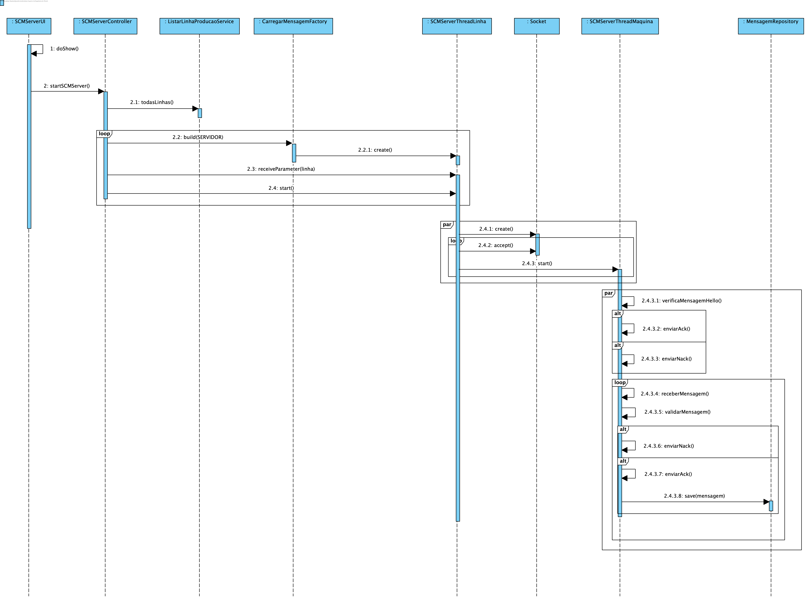
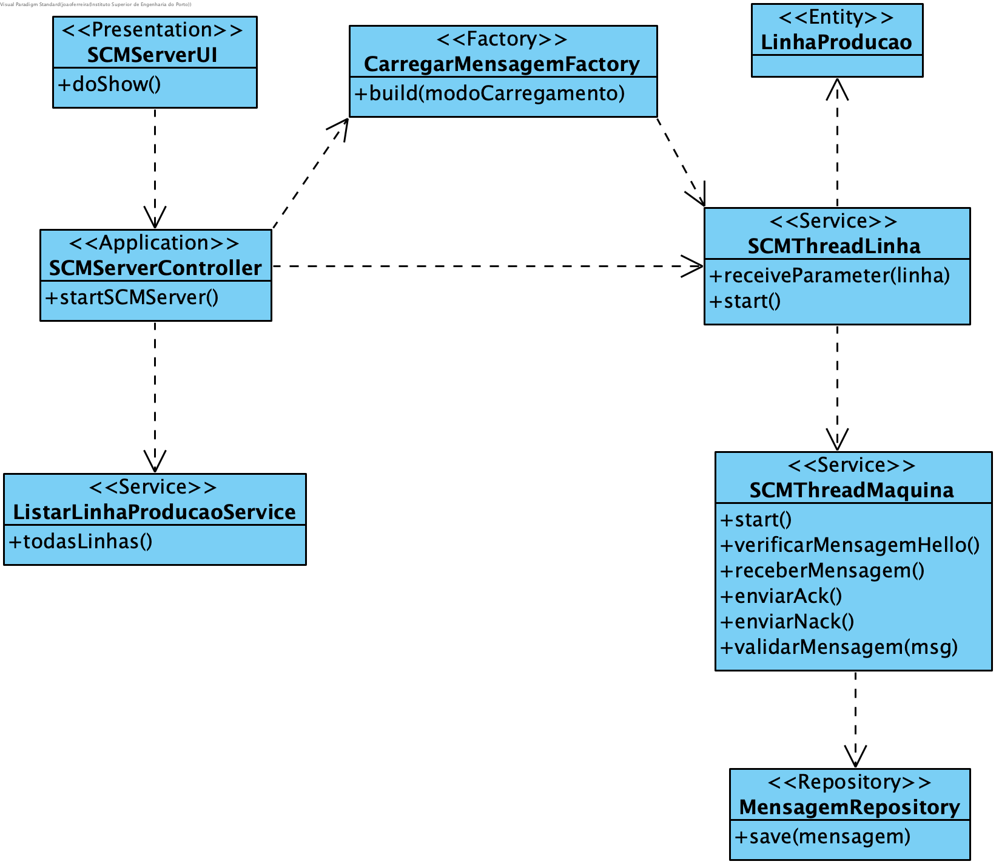

**João Ferreira [1181436](../)** - Recolher mensagens geradas nas/pelas máquinas de uma determinada linha de produção
=======================================

# 1. Requisitos

- As mensagens recolhidas devem ser disponibilizadas para posterior processamento.
- Deve ser criado um log de todas as mensagens recebidas das máquinas.
- A recolha das mensagens deve ser feita de forma concorrente (por linha e máquina).

# 2. Análise

## 2.1 Regras de Negócio

- As mensagens têm de ser de uma máquina existente no Sistema.
- A aplicação deve utilizar threads para recolha paralela das mensagens.
- A máquina deve estar registada no sistema e pertencer à linha em monitorização.

# 3. Design

## 3.1. Realização da Funcionalidade

## 3.2. Diagrama de Classes

## 3.3. Padrões Aplicados

Aplicar o padrão Repository Factory que permite criar repositórios de forma dinâmica e isolar o controller do US da tecnologia utilizada para a persistência de dados.

A implementação deste US passará pela implementação do padrão estratégia Estratégia . Para este efeito deverá ser cria uma factory CarregarMensagemFactory que detém a responsabilidade de devolver a construir e devolver o importador correto para o modo de recepção de mensagens (passado por parâmetro).

## 3.4. Testes

**Testes funcionais:**
Deverão ser realizados testes com um cliente TCP para garantir as regras de negócio previamente enunciadas e o correto funcionamento do servidor. Assim como a correta persistência das mensagens no Sistema.

# 4. Implementação

[Controller](https://bitbucket.org/joaomfas/lei_isep_2019_20_sem4_2na_1181436_1171668_1171865_1190293/src/master/app/base.core/src/main/java/eapli/base/gestaomensagens/application/SCMServerController.java)

[Thread Linha de Produção](https://bitbucket.org/joaomfas/lei_isep_2019_20_sem4_2na_1181436_1171668_1171865_1190293/src/master/app/base.core/src/main/java/eapli/base/gestaomensagens/application/SCMServerThreadLinha.java)

[Thread Máquina](https://bitbucket.org/joaomfas/lei_isep_2019_20_sem4_2na_1181436_1171668_1171865_1190293/src/master/app/base.core/src/main/java/eapli/base/gestaomensagens/application/SCMServerThreadMaquina.java)

# 5. Integração/Demonstração

O padrão estratégia aplicado irá ser uma adição ao já criado no US4001.

# 6. Observações

Sem observações.
