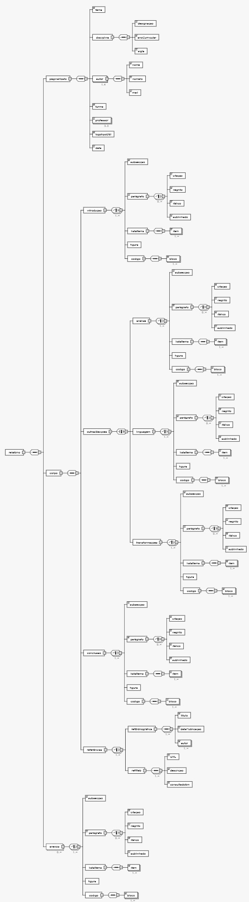
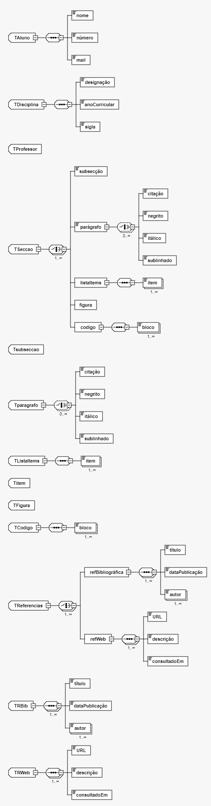

**João Ferreira [1181436](../)** - Elaborar um relatório que descreva todas as aplicações de XML, XSD, XSLT e XPATH no sistema.
=======================================

# 1. Requisitos

- Como Gestor de Projeto, eu pretendo que a equipa elabore um relatório que descreva todas as aplicações de XML, XSD, XSLT e XPATH no sistema.

# 2. Análise

## 2.1 Regras de Negócio

- O resultado deve ser um documento XML em conformidade com o XSD de relatório disponibilizado, complementado com uma transformação para um documento XHTML que facilite a sua leitura integral.

# 3. Design

Para a elaboração do relatório deve começar por se analisar o documento XSD fornecido para detetar o tipo de informação que deve constar no documento XML.
As principais secções do relatório são:
  - Capa: identificação do tema do trabalho, a disciplina em que se enquadra, curso, ano letivo, turma prática laboratorial e a identificação completa dos alunos do grupo.
  - Índice
  - Introdução: Identificação e descrição do trabalho e objetivos propostos.
  - Análise:  Especificação da análise do domínio do problema proposto.
  - Linguagem: Definição da sintaxe da linguagem proposta através de um XMLSchema e criação de um documento XML instância válida dessa linguagem.
  - Transformações: Descrição de StyleSheets (XSLT) adequadas à transformação da informação do documento XML em novos formatos.
  - Conclusão
  - Anexos

Após a elaboração do relatório deve ser criado o documento XSLT que permite a transformação do documento XML num documento HTML.

# 4. Integração/Demonstração

Sem observações.

# 5. Observações

Sem observações.
