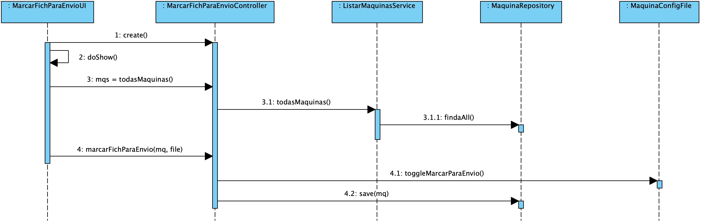
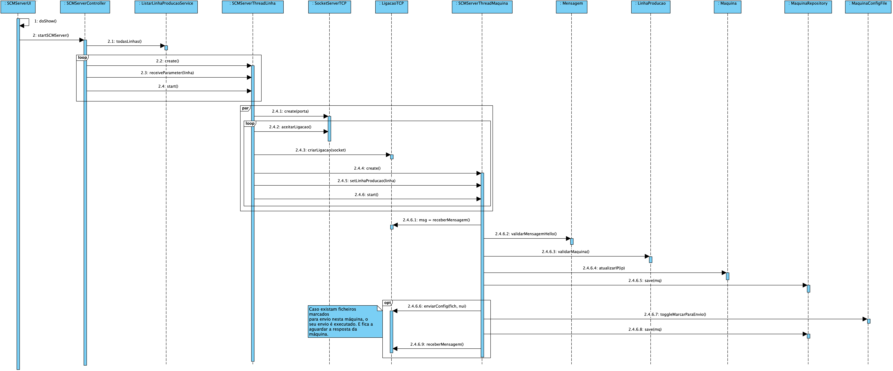
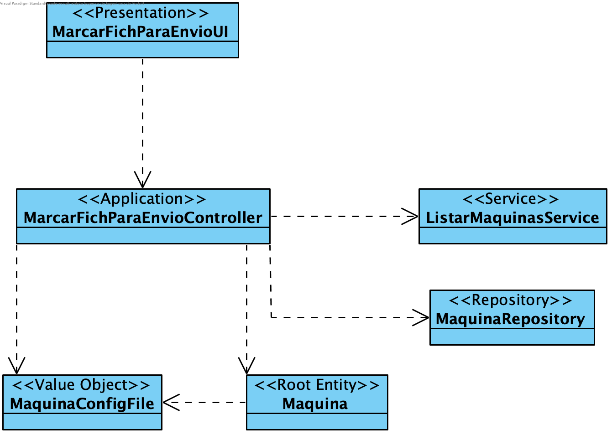
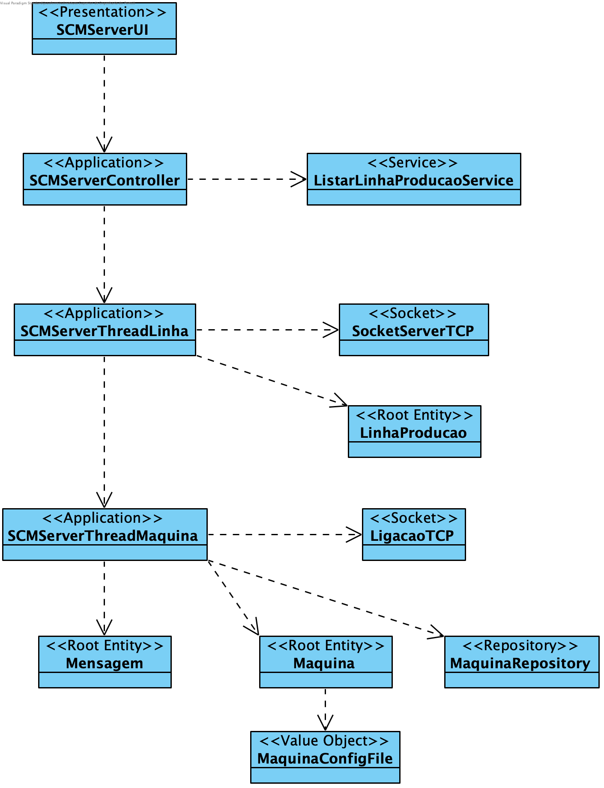

**João Ferreira [1181436](../)** - Solicitar o envio de uma determinada configuração para uma máquina
=======================================

# 1. Requisitos

- Como Gestor de Chão de Fábrica, eu pretendo solicitar o envio de uma determinada configuração para uma máquina

# 2. Análise

## 2.1 Regras de Negócio

- O ficheiro deve ser enviado assim que a Máquina se ligar ao Sistema Central (SCM);
- O pedido CONFIG deve ter o ID referente à Máquina a que se destina;
- Caso a máquina aceite o pedido enviará uma resposta ACK. Caso rejeite, enviará uma reposta NACK.

# 3. Design

Este Use Case deverá ser realizado em duas etapas:
  - Dar a possibilidade ao Gestor de Chão de Fábrica de poder marcar um ficheiro, previamente inserido no sistema, para envio para uma determinada máquina;
  - O Sistema Central (SCM) deverá proceder ao envio do ficheiro assim que a Máquina de destino se ligar.

## 3.1. Realização da Funcionalidade

## 3.2. Diagrama de Classes

## 3.3. Padrões Aplicados

Aplicar o padrão Repository Factory que permite criar repositórios de forma dinâmica e isolar o controller do US da tecnologia utilizada para a persistência de dados.

## 3.4. Testes
**Testes manuais:**
Os testes manuais servirão para eliminar possíveis bugs na UI e garantir o correto comportamento da aplicação ao serem inseridos dados inválidos.

# 4. Implementação
[User Interface](https://bitbucket.org/joaomfas/lei_isep_2019_20_sem4_2na_1181436_1171668_1171865_1190293/src/master/app/base.app.backoffice.console/src/main/java/eapli/base/app/backoffice/presentation/ordensproducao/AdicionarOrdemProducaoUI.java)

[Controller](https://bitbucket.org/joaomfas/lei_isep_2019_20_sem4_2na_1181436_1171668_1171865_1190293/src/master/app/base.core/src/main/java/eapli/base/gestaoordensproducao/application/AdicionarOrdemProducaoController.java)

# 5. Integração/Demonstração

Sem observações.

# 6. Observações

Sem observações.
