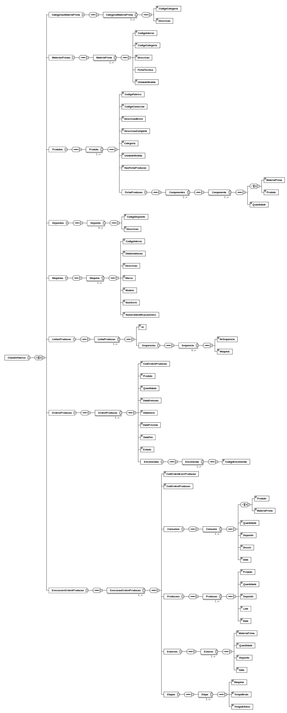

**Thiago Farias [1190293](../)** - [1010] Criação de um ficheiro XSD para validar conteudo XML gerado pelo sistema
=======================================

# 1. Requisitos
Como Gestor de Projeto, eu pretendo que a equipa especifique um documento XSD que possa ser, posteriormente, usado para validar o conteúdo XML gerado pelo sistema.
O XSD deve contemplar toda a infomação subjacente ao chão de fábrica (e.g. produtos, matérias-primas, máquinas, linhas de produção, categorias, ordens de produção, fichas de produção, lotes, consumos reais e efetivos, estornos, desvios, tempos de produção,  entre outros).

A interpretação feita deste requisito foi no sentido de desenvolver um ficheiro XSD que valide o XML gerado, estando de acordo com o domínio do projeto.

# 2. Análise
## 2.1 Regras de Negócio

O ficheiro XSD deverá conter todos os conceitos de negócio e que guardam valor na base de dados, relativos ao chão de fábrica:

- Categorias de matéria-prima;
- Matérias-primas;
- Produtos;
- Depósitos;
- Máquinas;
- Linhas de produção;
- Ordens de produção;
- Execução de ordem de produção.

# 3. Design
## 3.1. Representação Gráfica do XSD

## 3.2. Testes

  O XSD foi desenvolvido com auxílio da IDE "Liquid Studio" que permite gerir links entre ficheiros xml e respetivos xsd validadores assim como ficheiros auxiliares para o xsd.
  Os testes basearam-se em testes manuais onde ficheiros xml editados propositalmente com erros foram submetidos a validação com base no xsd. Desta forma a própria IDE identifica as imcompatibilidades e apresenta notificações de localização e razão do erro.

# 6. Observações

  O XSD principal nomeado como ChaoDeFabrica.xsd possui link com um ficheiro xsd auxiliar nomeado AuxTypes.xsd onde foram declarados sympleTypes customizados que são chamados no ChaoDeFabrica.xsd que possui a estrutura principal que validará o xml gerado com informações do chão de fábrica.