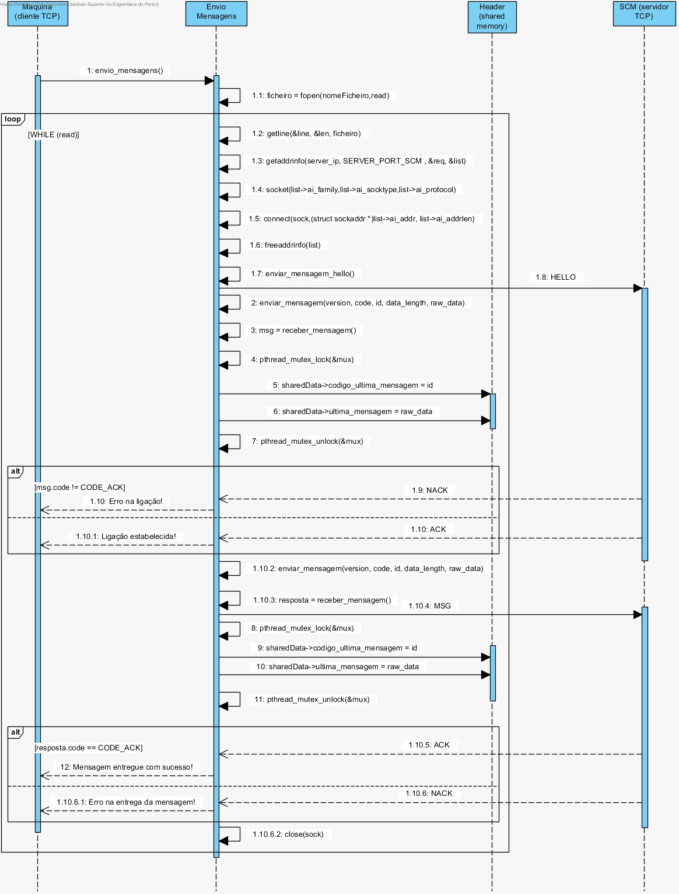

**Thiago Farias [1190293](../)** - [1011] Desenvolver aplicação que simule o funcionamento de uma máquina relativamente ao envio de mensagens geradas
====

# 1. Requisitos

Como Gestor de Projeto, eu pretendo que a equipa desenvolva uma aplicação que simule o funcionamento de uma máquina, nomeadamente no envio de mensagens geradas por estas.

# 2. Análise
## 2.1 Regras de Negócio

A comunicação entre o sistema central e as máquinas é baseada em TCP e assenta nos seguintes
pressupostos:

* Cada máquina industrial conhece:

  * O seu próprio número de identificação único;

  * O endereço de rede ou o nome DNS do sistema central.

* O sistema central conhece o número de identificação único de cada máquina industrial através do
seu repositório de dados. Contudo, o endereço de rede de cada máquina industrial somente é
conhecido depois de este ter sido ser contatado pela máquina através de uma mensagem HELLO.

* Quando uma máquina industrial é iniciada, ela envia um pedido HELLO baseada em TCP para o sistema
central e guarda a resposta com um ACK ou NACK.

* As máquinas industriais enviam pedidos MSG baseadas em TCP ao sistema central e recebem uma
resposta ACK ou NACK.

* O sistema central envia pedidos CONFIG baseadas em TCP para as máquinas industriais. Caso o ID
constante no pedido corresponda ao ID da máquina industrial deve ser retornado uma resposta ACK.
Caso contrário, o pedido deve ser recusado e uma resposta NACK é retornada.

# 3. Design
## 3.1. Realização da Funcionalidade

# 4. Implementação

- Utilizada uma thread no simulador de máquina para funcinonar como servidor TCP;
- Foi criada uma área de memória partilhada para partilha entre threads do estado da mensagem e a respetiva mensagem;
- De forma a garantir que não existe acesso simultâneo à zona de memória partilhada, utiliza-se um mutex.

[Envio de mensagens](https://bitbucket.org/joaomfas/lei_isep_2019_20_sem4_2na_1181436_1171668_1171865_1190293/src/master/app/simuladormaquina/envio_mensagens.c)

[Simulador de Máquina](https://bitbucket.org/joaomfas/lei_isep_2019_20_sem4_2na_1181436_1171668_1171865_1190293/src/master/app/simuladormaquina/maquina.c)

# 5. Integração/Demonstração

- Esta US integra o simulador de máquina juntamente com a US1012.

# 6. Observações

Sem observações.
